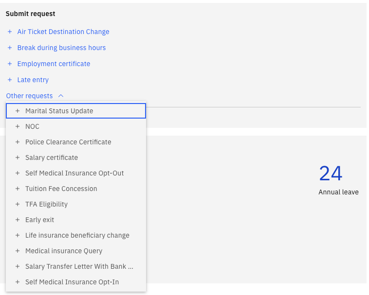

# Submit an HR request

HR Requests lets you submit formal requests to the HR team directly through ESS. The available request types are configured by HR — only types enabled for ESS are shown.

1. Navigate to HR Requests

   From the ESS home page, navigate to the **HR Requests** section.

2. Select a request type

   Choose the type of request you want to submit from the list — for example, Police Clearance Certificate, Early Exit, or Late Entry. Request types appear in the order configured by HR.

   

3. Fill in the form

   Complete the fields shown on the form. Fields marked as mandatory must be filled before you can submit. Fields vary by request type — for example, an Early Exit request includes fields for a covering person, effective date, time, handover notes, and reason.

4. Attach a file (optional)

   Use the **Choose a file** control to attach any relevant supporting documentation.

5. Submit

   Click **Submit** to send your request. A system-generated **request number** is assigned and the current status is displayed.

6. Cancel if needed

   If you no longer need the request, click **Cancel** to withdraw it while it is still pending.
