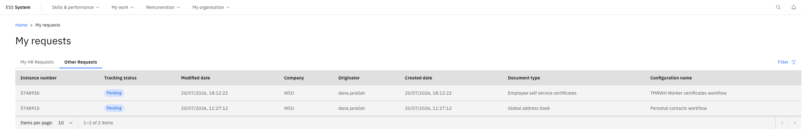

# Track your submitted HR requests

All requests you have submitted are visible in the HR Requests section. Once HR processes a request, you can see their feedback and any documents they have provided.

1. Open HR Requests

   From the ESS home page, navigate to the **HR Requests** section. Your request history is listed here, each showing a request number and current status.

2. Open a request

   Click on a request to open its full detail view.

3. Check the status and feedback

   For a completed request, you will see:
   - **Status**: for example, Approved
   - **HR Feedback**: any notes or response the HR team entered
   - **Attached documents**: both the file you submitted and any document HR attached

   

4. Download documents

   Click the **Download** link next to any document to save it.

   > **Note:** After HR completes a request, there is typically a 3–5 minute delay before the updated status appears — the ESS cache refreshes on a 5-minute cycle.
