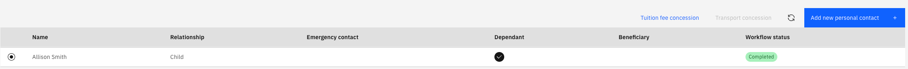

# Submit a tuition fee request

The Tuition Fee request lets eligible employees apply for a tuition fee concession for a dependent child enrolled at a GEMS school. The request button is only active once your dependent is approved in the system and marked as a full-time GEMS student.

1. Navigate to the Tuition Fee request

   From the ESS home page, navigate to the **HR Requests** section and locate the **Tuition Fee** request.

2. Check eligibility

   The **Tuition Fee** button is enabled only when:
   - The dependent has been approved through the workflow (added to your profile and confirmed by HR)
   - The dependent is flagged as a **Full-Time Student** at a GEMS school

   If the button is greyed out, check that your dependent record is approved and has the **Full-Time Student** flag set. See [Add a personal contact](./../../ess/02-Profile/04-add-personal-contact.md) for how to add and flag a dependent.

   If you have already submitted a tuition fee request for this dependent, the button will be greyed out and cannot be resubmitted.

3. Select the dependent

   Choose the child or dependent this request is for from the selection list.

   

4. Complete the form

   Add any relevant notes and select a reason code if applicable.

5. Submit

   Click **Submit** to send the request. It is processed as an HR Request through the standard approval workflow.
