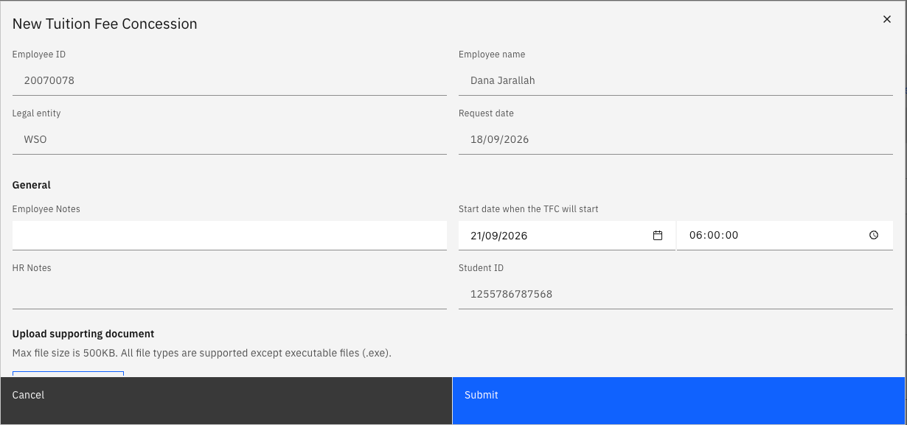

# Submit a tuition fee request

The Tuition Fee Concession request lets eligible employees apply for a tuition fee concession for a dependent child enrolled at a GEMS school. The request button is only active once your dependent is approved in the system and marked as a full-time GEMS student.

1. Open your Full Profile

   On the ESS homepage, click **Full profile** to the right of your profile header tile.

2. Select the dependent

   Open the **Personal contacts** tab. Select your dependents from the list by clicking the radio button beside their name. This will activate the **Tuition fee concession** link above the table. Click the link.

   

3. Complete the form

   Check the pre-filled data: your employee name and number, entity and request date. Complete the start date and upload any supporting documents. Then click **Submit**.

   

