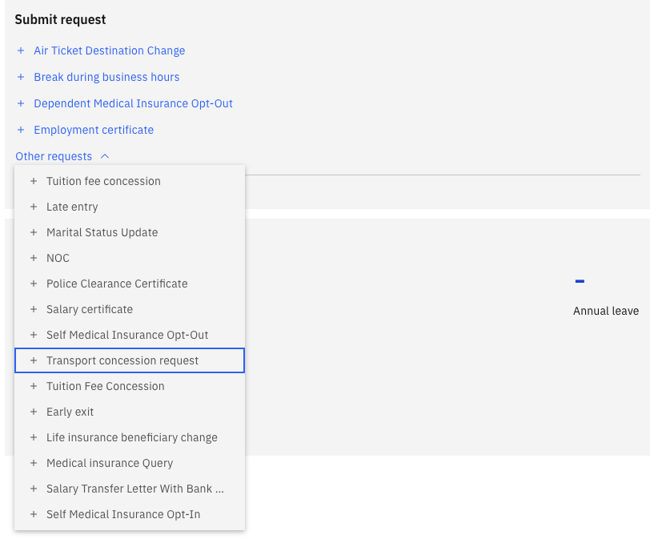

# Submit a transport request

The Transport request lets eligible employees request transport for a dependent child. Unlike standard HR requests, the transport request runs as an integration with the external Phoenix system, which validates student details before processing.

1. Navigate to the Transport request

   From the ESS home page, navigate to the **HR Requests** section and locate the **Transport** request.

2. Check eligibility

   The Transport button is only active when:
   - The dependent has been approved in the system
   - The dependent has a valid **student ID** and **school** recorded

   If validation details are missing, the request cannot be submitted. Confirm the dependent record is complete before proceeding.

3. Select the dependent

   Choose the child or dependent this request is for.

4. Confirm student details

   Verify the **student ID** and **school** fields — these are required for the integration call to Phoenix to validate the student's enrolment.

   

5. Complete the form

   Fill in any remaining required fields.

6. Save and submit

   Click **Save Changes** to submit. The system runs a validation against Phoenix to confirm the student's details. If validation passes, the request is processed through the workflow. If the dependent is not yet approved in the system, the request cannot be submitted.
