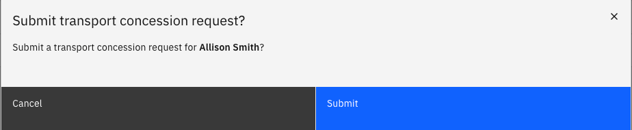

# Submit a transport request

The Transport request lets eligible employees request transport for a dependent child. Unlike standard HR requests, the transport request runs as an integration with the external Phoenix system, which validates student details before processing.

1. Open your Full Profile

   On the ESS homepage, to the right of your profile header tile, click **Full profile**.

2. Select the dependent

   Open the **personal contacts** tab. Select your dependents from the list by clicking the radio button beside their name. This will activate the **Transport concession** link above the table. Click the link.

   

3. Click submit

   A popup prompt will appear on the screen asking to confirm that you want to submit a transport concession request. Click **Submit**.

   
