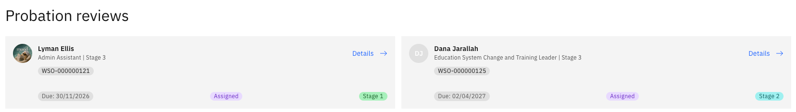

# Complete a probation review as a manager

When one of your team members is due a probation review, it is routed to you via the workflow. You receive a notification, and the review appears in your ESS queue.

1. Open your probation review queue

   From the ESS portal, go to **Skills & performance ▸ Performance Management ▸ Team Probation Review Requests**. Pending reviews are listed here. You can also find them in your **Manager View** or **My Team** section.

2. Open the review

   Click on the review to open the full form. You will see the employee's name, the due date, and the review type (Stage 1 or Stage 2).

   

3. Complete the competency ratings

   For each competency listed, select a rating from the dropdown (e.g., Meets Expectations, Concerns, Needs Improvement) and add your comments in the **Manager Comments** field. The employee's comment field is read-only at this stage.

4. Add overall comments

   Fill in the **Overall Manager Comments** field to summarise your overall assessment.

5. For Stage 2 reviews — set the Review Outcome

   Stage 2 reviews include an additional field:

   | Outcome | What happens next |
   |---|---|
   | **Meets Expectations** | The review is passed to the employee for their feedback, and HR is notified simultaneously |
   | **Performance Concerns** | The review routes directly to HR only — the employee is not informed of the outcome at this stage |

   Stage 2 forms also show Stage 1 comments alongside Stage 2 fields for each competency, so you can review the progression.

6. Submit

   Click **Submit** to complete your review. A confirmation message confirms successful submission, and the review is removed from your queue.
