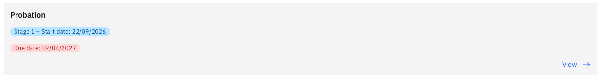

# Complete your probation feedback

After your manager submits their probation review, the workflow routes it to you for your response. You will receive a notification when your feedback is due.

1. Open the probation review

   From the ESS portal, go to **Employment ▸ Probation Review** (the review appears here when it is assigned to you for feedback).

2. Read your manager's assessment

   The form shows:
   - Your manager's ratings for each competency (read-only)
   - Your manager's comments for each competency (read-only)
   - For Stage 2 reviews: Stage 1 ratings and comments are shown side-by-side with the Stage 2 fields so you can see your progression

   

3. Add your feedback

   Enter your response in the **Employee Comment** fields for each competency. An **Employee Overall Comment** field is also available for a summary response.

4. Submit

   Click **Submit** to finalise your feedback. The review is removed from your ESS queue and the workflow moves to the next stage (HR notification for Stage 2, or completion for Stage 1).
