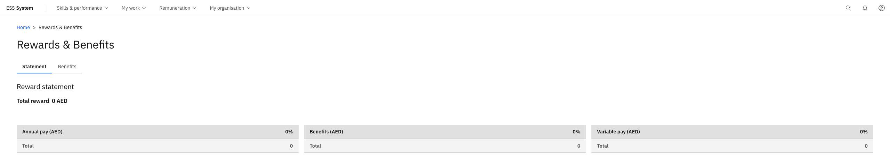

# View your rewards statement

Your rewards statement in ESS gives you a personalised view of your total compensation package — including salary, allowances, benefit entitlements, and concessions. This is a read-only view; your entitlements are set up and maintained by the HR and Finance teams.

1. Open the Benefits section

   From the ESS portal, navigate to the **Benefits** section to open your rewards statement.

2. Review your total reward

   At the top of the statement you can see your **total reward** — the combined value of your salary, benefits, and variable pay.

   

3. Review your pay and benefits breakdown

   Scroll through the statement to review:

   - **Pay** — your base salary
   - **Benefits** — the combined value of your benefit entitlements
   - **Variable pay** — bonuses or other variable components

   On the right-hand side of the statement, your benefits are broken down into individual categories such as fixed allowances and other applicable components.

4. Review concessions and additional entitlements

   Further down the statement you can see:

   - **Children's concessions** — tuition fee and transport concessions listed per child, including the student ID
   - **Visa disbursements** — any visa-related allowances
   - **Bonuses** — where applicable

   Airfare entitlements are visible on the statement; the amount displayed reflects actuals integrated from the payroll system.

   

   If you have questions about your statement or believe something is incorrect, contact your HR team directly.
