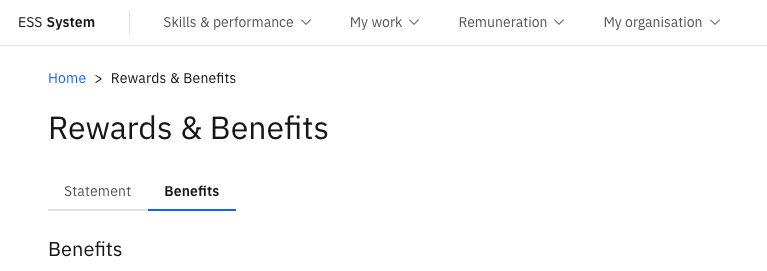
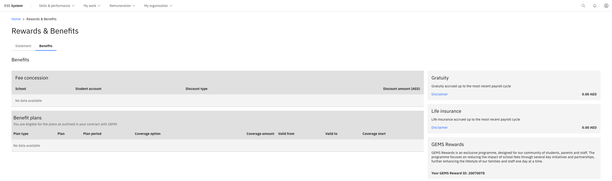

# View your benefit plan details

The Benefits tab in ESS shows the individual benefit plans you are enrolled in and the entitlement values associated with each. This is a read-only view; your benefit plans are set up and maintained by the HR team.

1. Open the Benefits section

   From the ESS portal, navigate to the **Rewards & Benefits** section.

2. Open the Benefits tab

   Select the **Benefits** tab within the section.

   

3. Review your benefit plan details

   The tab displays:

   - The **benefit plans** you are enrolled in — for example, medical insurance, transport, accommodation, and life insurance
   - The **entitlement amount** associated with each plan
   - **Gratuity** — the value calculated from your payroll disbursement record

   

   If you have questions about your benefit plans or believe something is incorrect, contact your HR team directly.
