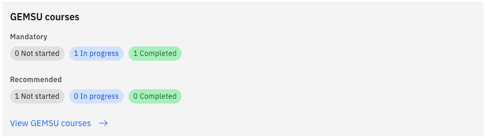
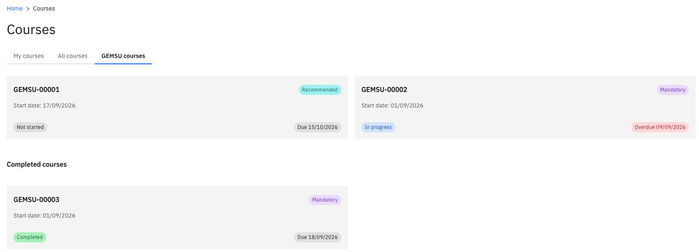

# View your GEMSU courses

Your GEMSU learning is surfaced directly in ESS, so you don't need to go into GEMSU to see where you stand. Courses flow into ESS automatically through the integration between GEMSU and ESS — this is a read-only view, and you still complete the courses themselves in GEMSU.

1. Open your courses

   From the ESS home page, click the **GEMSU courses** tile. This opens your GEMSU course list.

   

2. Review your courses in progress

   The list shows every course currently assigned to you. Each course carries a tag showing whether it is **Mandatory** or **Recommended**, so you can see at a glance what you're required to complete.

   Courses you have opened show as **In progress**. Courses assigned to you but not yet opened show as **Not started**.

   

3. Check for overdue courses

   Any course whose start date has passed is flagged as **Overdue**. Use this flag to prioritise — an overdue mandatory course is the one to pick up first.

4. Review your completed courses

   Completed courses stay on the list with a **Completed** status, and keep their **Mandatory** or **Recommended** tag. This gives you a running record of the learning you have finished.

   If a course you have completed in GEMSU still shows as in progress in ESS, allow time for the integration to run before raising it with your HR team.
