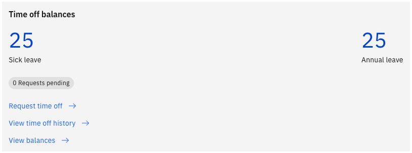
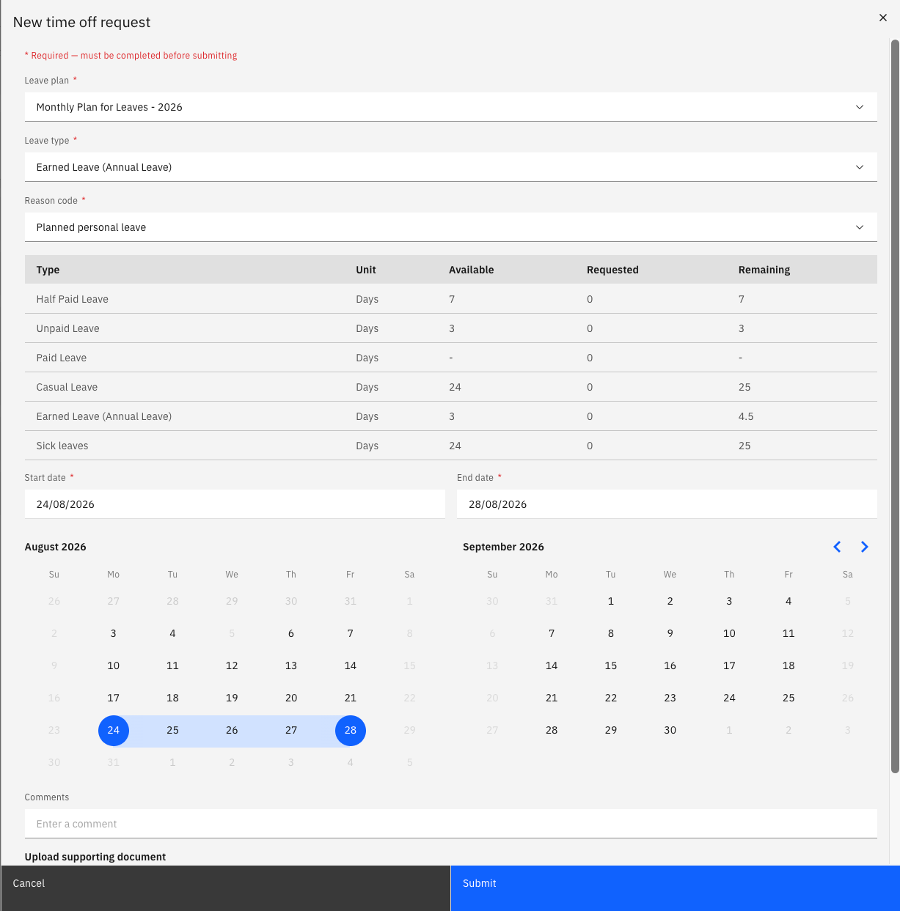

# Submit a leave request

Leave is requested from ESS. You choose the plan and type of leave you want to take, select your dates, and submit — the request then follows the approval workflow set up for your school.

1. Open the time off request form

   In ESS, go to **Request time off**.

   

2. Choose your leave plan

   Select the **leave plan** you are enrolled in. You are enrolled in your plans automatically when you are hired, and your enrolment is updated if you move to a new position — so the plans you see reflect your current role.

   You only see the plans and types your school has chosen to make available in ESS. If a plan or type you expect isn't in the list, contact your HR team.

3. Choose your leave type

   Select the **leave type** within that plan — for example annual leave, casual leave, sick leave, or a grant-based type such as maternity leave.

4. Select a reason code

   Where the leave type requires it, choose a **reason code** — for example, illness against a sick leave request. The reason codes available depend on the leave type you selected.

5. Select your dates

   Pick your **start date** and **end date**. The system calculates the number of days from your calendar, so weekends and public holidays already in the calendar are skipped and are not deducted from your balance.

   

6. Check the rules that apply to your leave type

   Some leave types carry additional rules, and these are checked when you submit:

   - **Advance notice** — longer periods may have to be requested a set number of days ahead. If you request 14 or more consecutive days of a type with a 40-day notice rule, for example, you see: *Leave requests of 14 days or more for this type must be submitted at least 40 days in advance.* Move your dates further out, or shorten the request.
   - **Supporting documents** — sick leave beyond a set number of days requires a medical certificate. See [Attach a medical certificate to a sick leave request](./03-attach-a-medical-certificate.md).
   - **Full entitlement at once** — grant-based types such as maternity leave must be taken as one block. See [Submit a grant-based leave request](./02-submit-a-grant-based-leave.md).

7. Submit the request

   Click **Submit**. The request is created with a status of **In review** and routed to your approver. You can see it, and its current status, under your time off requests.

   Your leave balance updates once the request is approved. If you need to withdraw a request, see [Cancel a leave request](./04-cancel-a-leave-request.md).
