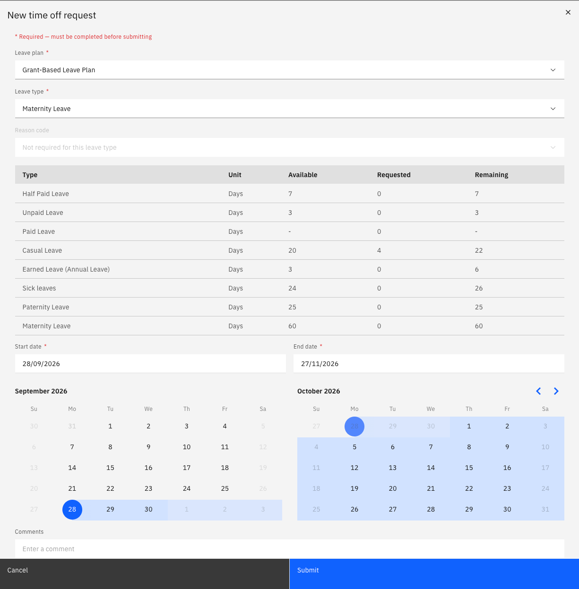

# Submit a grant-based leave request

Some leave types are granted as a fixed entitlement that must be taken in a single block—maternity and paternity leave are common examples. For these types, you choose the start date, and the system calculates the rest.

1. Start a time off request

   In ESS, go to **Request time off** and select the leave plan and leave type — for example, maternity leave.

2. Select your start date

   Choose the date you want the leave to begin. This is the only date you set.

3. Let the system calculate the end date

   As soon as you select the start date, the system applies the full grant for that leave type — 60 working days for maternity leave, for example — and calculates the end date. You cannot shorten the block or change the end date because you must take the entitlement all at once.

   

4. Check how the calendar has been applied

   The calculation uses your own calendar. Weekends and any recorded public holidays are skipped and shown greyed out on the request, so the block extends past them rather than consuming them.

5. Submit the request

   Click **Submit**. The request is created with a status of **In review** and routed for approval like any other leave request.

   If you need a shorter period than the full grant, speak to your HR team — the block cannot be broken up in ESS.
