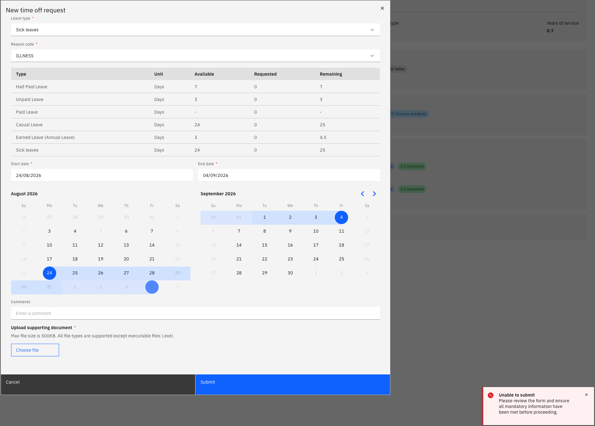

# Attach a medical certificate to a sick leave request

Sick leave often needs a supporting medical certificate. Whether one is required depends on your probation status and the length of the absence — the system checks this when you submit and tells you if a document is missing.

1. Start your sick leave request

   In ESS, go to **Request time off**, select the leave plan containing sick leave, choose **Sick leave** as the leave type, and select the reason code — for example, illness.

2. Select your dates

   Pick the start and end dates for the absence.

3. Submit and check for the attachment prompt

   Click **Submit**. If a certificate is needed, the request is not accepted and you see the notification *Please record at least one document*.

   

   When this appears depends on your status:

   | Your status | When a certificate is required |
   |---|---|
   | **Pending confirmation** (within probation) | For any sick leave request, from the first day |
   | **Confirmed** (outside probation) | Only once the absence exceeds the threshold set for your school — three days, for example |

4. Upload the certificate

   Attach your medical certificate to the request.

5. Submit again

   Click **Submit**. With the document attached the request is accepted and routed for approval as normal.

   The same rule can be applied to other leave types, not just sick leave. If you are unsure whether a certificate is needed, submit the request — the system tells you if one is missing before it accepts it.
