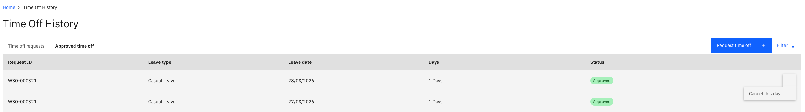

# Cancel a leave request

You can cancel leave you no longer intend to take, and the days go back to your balance. There is a limit on how far back you can go — old leave is locked so that previous periods cannot be reopened.

1. Find the request

   Open your time off requests and select the approved request you want to cancel.

   

2. Click Cancel

   Click **Cancel** on the request.

3. Add a comment

   Record why you are cancelling — for example, *No longer taking this leave, please cancel*. The comment goes to your approver with the cancellation.

4. Submit the cancellation

   Click **Submit**. The cancellation request appears against the original leave and follows the approval workflow.

5. If the cancellation is refused

   If the leave is too old to cancel, you see a message such as *Cancellation is not permitted because this request is 16 days old*, and the request stays as it is.

   The window is measured from the **start date of the leave**, not from the date you submitted it, and the number of days is set by your school. If you need leave outside the window reversed, contact your HR team.
