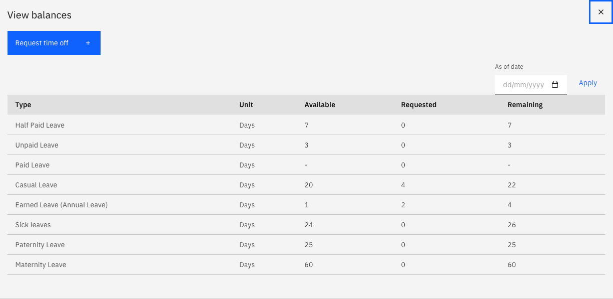
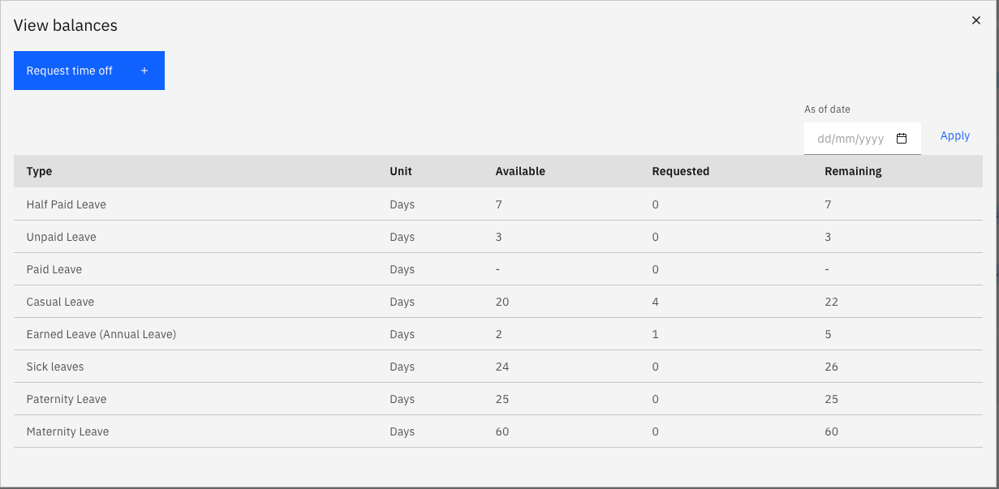

# Understand how calendar changes affect your leave

Public holidays are sometimes announced or moved after you have already booked leave. When that happens the system adjusts your existing requests for you — you do not need to cancel and rebook, and the adjustments do not need approving.

1. Recognise a system-generated adjustment

   Any change the system makes is raised as its own request, flagged as system generated. These are approved automatically, so they move straight to completed rather than sitting with your manager.

   

2. A holiday is announced on a day you had approved leave

   The day is cancelled from your leave and returned to your balance. For example, if you had one day of annual leave approved on 4 September and that date is then announced as a public holiday, the system cancels that day and your balance goes back up.

3. A holiday is announced during leave you have in review

   The day is removed from the request and the day count reduces — a five-day request covering 24 to 28 August becomes a four-day request if 26 August is announced as a holiday. The request stays in review with your approver and keeps its original submission date.

   

4. A holiday is moved off a day inside your leave

   The reverse also happens. If a day inside your leave was a public holiday and that holiday is moved elsewhere, the day becomes a working day — so the system submits leave for it automatically and approves it, keeping your leave continuous. Your balance is updated to reflect the extra day.

   This applies whether your original request was already approved or still in review.

5. Check your balance after a change

   Your leave balance reflects the adjustment once the system-generated request completes. If your balance or a request doesn't look right after a holiday announcement, contact your HR team — they can see the full history against the request.
