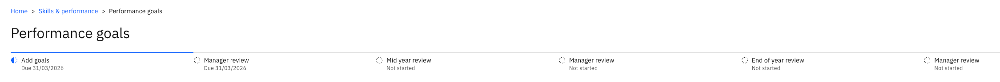
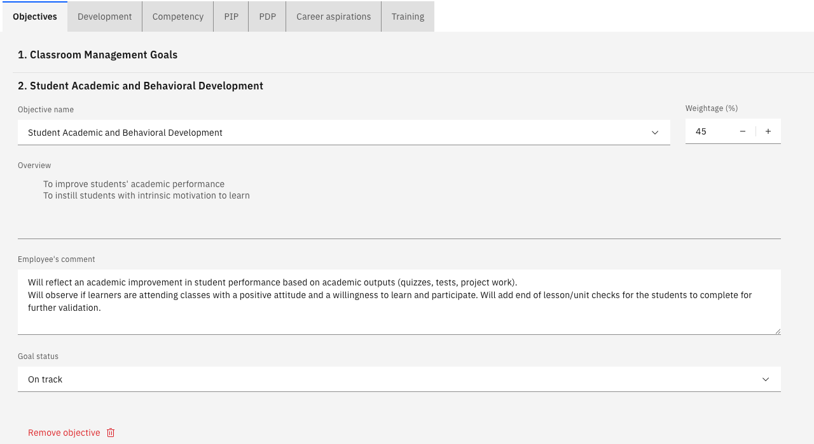
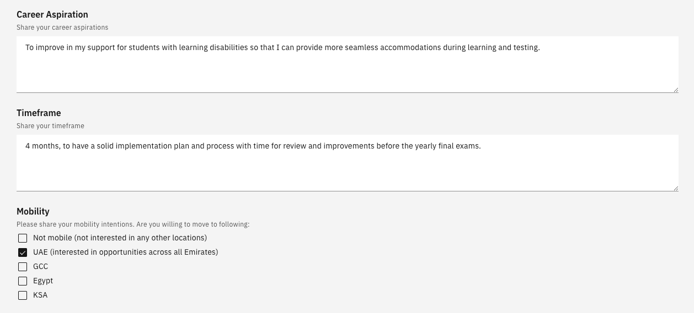
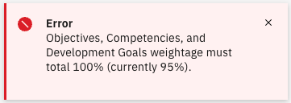

# Submit your goal setting review

Goal setting is the first stage of the performance year. HR releases the review to you with your goals already populated, and you complete it by setting how much each goal is worth, where it currently stands, and what you want from the year ahead.

1. Open your review

   In ESS, go to **Skills and performance** and find your reviews. Your goal setting review is listed with its due date.

   

   The timeline at the top of the review shows all the stages of the year — goal setting, mid year review and end of year review — with the current one highlighted and the others marked as not started.

2. Complete each goal

   Your goals are already there, copied from the template HR set up. Against each one, enter:

   - **Weighting** — how much of your overall performance this goal represents
   - **Comments** — what you plan to do, or where the goal currently stands
   - **Goal status** — for example, **On track**

   

   Click **Next** to move through your goals. Your review may carry several kinds — objectives, competencies, and PIP or PDP goals, depending on what has been set up for you.

3. Add or remove a goal

   Your review is not fixed to what was released. Click **Add a new goal** and select from the list to add one, or click **Remove** on a goal that no longer applies.

4. Record your career aspirations

   Enter where you would like your career to go — for example, moving into a leadership role — and the **time frame** you have in mind.

   Select your **mobility preferences** to indicate the locations you would consider. You can select more than one.

   

5. Record your training needs

   Enter the training and development you need — for example, further leadership training. There is also a flag you can select or clear against your training needs; set it to reflect your position.

6. Check your weightings total 100%

   Click **Submit**. If your weightings do not add up to 100% an error appears at the top of the screen and the review is not submitted — go back and adjust until the total is exactly 100.

   

   You cannot go over 100% either. The system blocks both an under-total and an over-total, so the weightings have to balance before the review will go.

7. Submit the review

   With the weightings correct, click **Submit** again. The review moves to **Ready for review** and goes to your manager.

   Your goal setting review then disappears from your list once the batch process runs. Your manager's feedback comes back to you at the mid year review — see [Submit your mid year review](./03-submit-your-mid-year-review.md).
