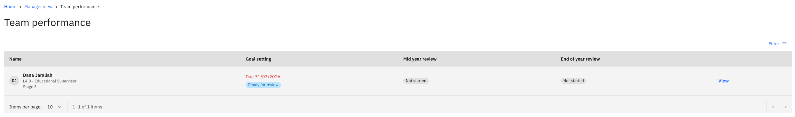
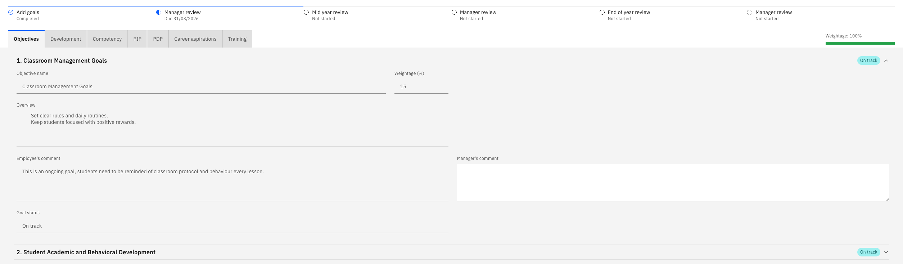
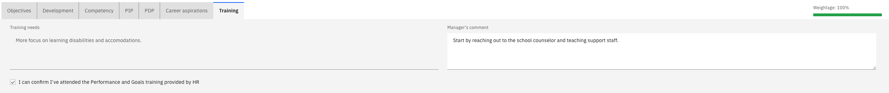

# Review your team's goal setting

When someone in your team submits their goal setting, the review comes to you for feedback. At this stage, you agree to the goals and the weightings they set—you comment on each one, but you do not rate them.

1. Open your manager view

   In ESS, go to your manager view and open your team's performance reviews. Reviews waiting for you are listed as **Ready for review** with their due date, and anything past its due date is flagged as overdue.

   

   The mid-year and end-of-year reviews for the same employee show as not started. They become available to you as the year progresses.

2. Open the review

   Click **View** on the review you want to work on. You'll see what the employee submitted—their goals, the weighting for each, and their comments—along with basic profile information for context.

   The timeline at the top shows the current stage of the year and which stages are complete.

   

3. Comment on each goal

   Work through the goals, adding your comments against each. Here, record your agreement with the goal and its weighting, or note anything you want changed.

   Click **Next** to move to the following goal. Your review will cover objectives, competencies and any PIP or PDP goals the employee carries.

4. Review career aspirations and training needs

   Toward the end, you'll see the employee's career aspirations—the roles they want to grow into and the mobility options they have selected—and their training needs. Add your comments against the training needs.

   

5. Submit the review

   Click **Submit**. This completes the goal-setting stage for that employee, and the review is removed from your list.

   You do not give ratings at goal setting. Ratings start at the mid-year review — see [Review your team's mid-year reviews](./04-review-your-teams-mid-year-reviews.md).

   The status updates to **Completed** once the workflow has processed. If it still shows as processing, refresh after a moment.
