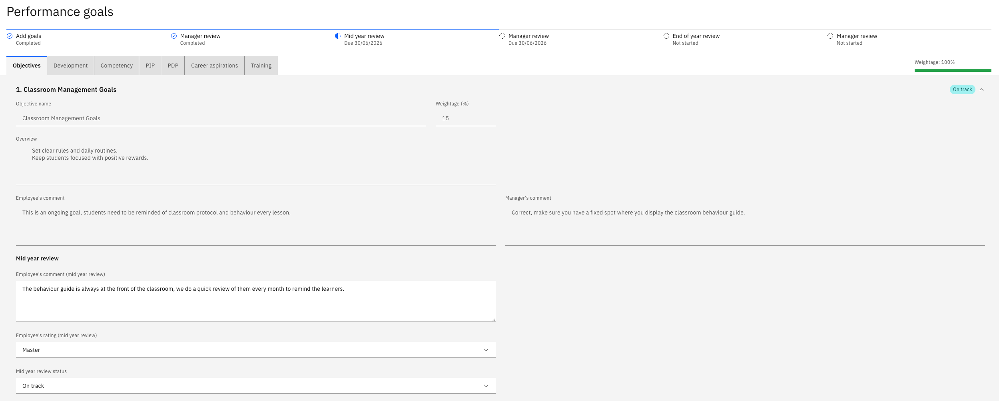
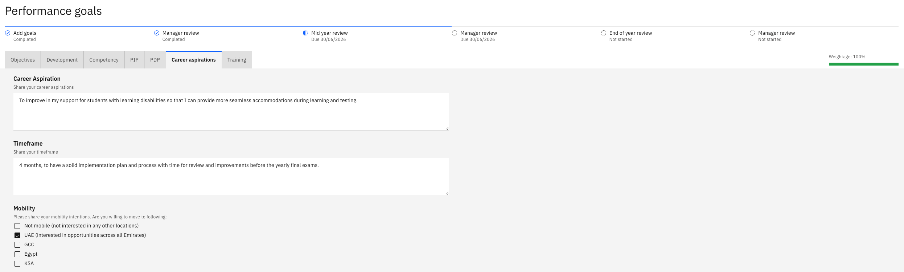

# Submit your mid year review

The mid-year review is your checkpoint against the goals you agreed on at goal setting. Everything from that first stage is carried forward, so you are updating a picture rather than starting again.

1. Open your review

   In ESS, go to **Skills and performance** and open your mid-year review.

   Your goals are copied across from goal setting, and the comments you and your manager made then are visible alongside them. You can see both sides of that earlier conversation as you work.

2. Add your mid-year comments

   Against each goal, add your comments on progress since goal setting. The earlier comments stay visible, so your update reads in context rather than replacing what came before.

   

3. Rate yourself against each goal

   Select your rating against each goal — for example, **Proficient**. Unlike goal setting, the mid-year review includes ratings, and your manager will rate each goal when the review comes to them.

   Click **Next** to move through your goals. PIP and PDP goals do not carry a weighting, as they are released to support your development rather than to be scored.

4. Update your career aspirations

   Your career aspirations from goal setting are shown. If anything has changed — a different role in mind, or different mobility preferences because your circumstances have changed — update them here and add any further comments.

   

5. Update your training needs

   Your training needs are shown with the comments made at goal setting. Update the record to reflect any training you have completed since.

6. Submit the review

   Click **Submit**. Your manager will receive the review for feedback.

   Once submitted, the review becomes read-only. You can still open it and see everything you entered, but you cannot change it — so check your comments and ratings before you submit.
