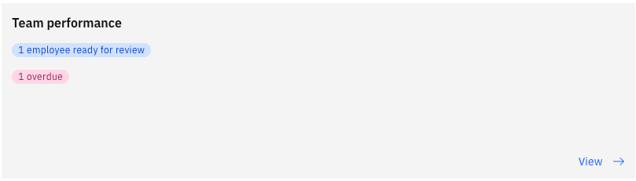
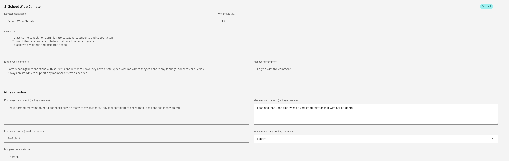

# Review your team's mid year reviews

At mid-year, you give your own rating alongside your comments. You can see what the employee has rated themselves and either match it or set a different rating where your view differs.

1. Open the review

   In ESS, go to your manager view and open your team's performance reviews. The mid-year review shows as **Ready for review** with its due date. Click **View**.

   

   You see the employee's profile information, their objective percentages, and your own comments from the goal-setting stage.

2. Comment on each goal

   Add your mid-year comments against each goal. The employee's comments and everything from goal setting stay visible, so your feedback sits in the context of the full conversation.

3. Give your rating

   Select your rating against each goal. Where you agree with the employee's self-rating, set the same value. If you disagree, enter the rating you think is right— for example, if they rated themselves proficient but you believe they are at a beginner level, record beginner.

   

   Click **Next** to move through the goals. Your review covers objectives, competencies, and any PIP or PDP goals.

   PIP and PDP goals do not carry a weighting in the scoring. They are released ad hoc to support an employee's development, so they sit outside the weighted calculation.

4. Review career aspirations and training needs

   You see where the employee wants to grow and the mobility options they have selected. You also see their training needs, including any training they have marked as completed. Add your comments.

5. Submit the review

   Click **Submit**. This completes the mid-year stage for that employee and removes the review from your list.

   If the list still shows the review as processing, refresh after a moment — the workflow takes a short time to complete.

The end-of-year review follows the same pattern but adds an overall rating and the submission to calibration — see [Review your team's end-of-year reviews](./06-review-your-teams-end-of-year-reviews.md).
