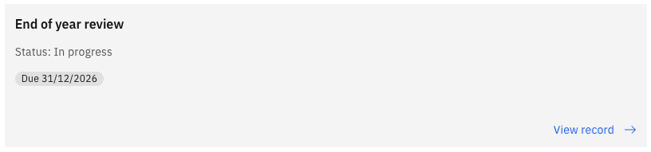
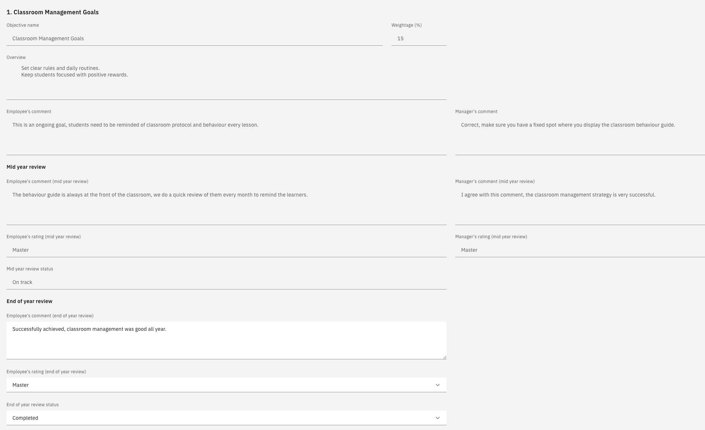
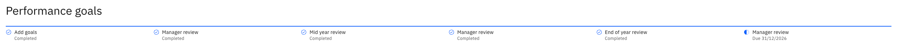

# Submit your end of year review

The end-of-year review closes your performance year. Everything from goal setting and the mid-year review is carried forward, so you are making your final assessment against goals you have been tracking all year.

> **Note:** If you missed an earlier review this year, you can still complete your end-of-year review. The system won't block it if you didn't submit goal setting or the mid-year review.

1. Open your review

   In ESS, go to **Skills and performance** and open your end-of-year review.

   

   Your goal-setting and mid-year review comments appear next to each goal, along with your manager's, so you can see the full year in one place.

2. Complete each goal

   For each goal, add your end-of-year comments, set your final rating, and mark the goal's status—for example, **Complete** when it has been achieved.

   

   Click **Next** to move through your goals.

3. Review career aspirations and training needs

   Your career aspirations and training needs are shown as they stand. Review them and make any final updates.

4. Check the timeline

   The timeline at the top of the review shows where you are in the year, with goal setting and the mid-year review marked complete.

5. Submit the review

   Click **Submit**. Your end-of-year review is marked as submitted, and the review moves to your manager, shown as manager review pending.

   

6. Wait for your calibrated rating

   Your manager completes their feedback, gives an overall rating, and submits your review for calibration. Your final rating is confirmed through that process and published back to you — see [View your calibrated rating](./09-view-your-calibrated-rating.md).
