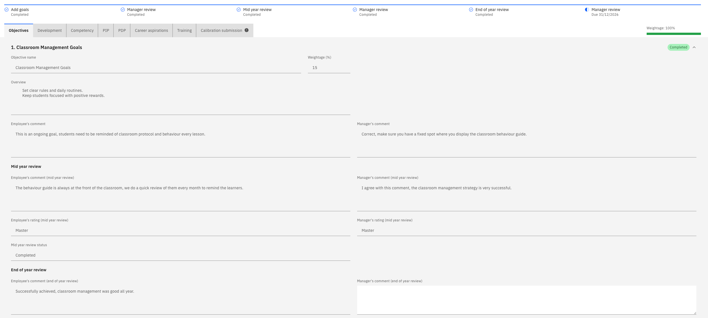
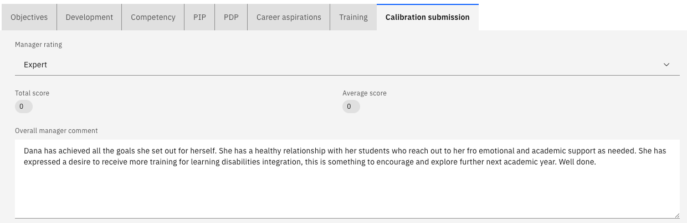
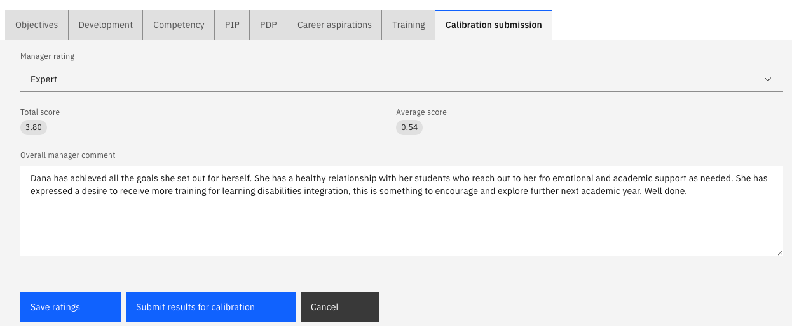

# Review your team's end of year reviews

The end of year review is where you set an employee's final ratings for the year and submit them for calibration. This stage feeds the calibration process, so the ratings you record here are the ones HR compares across the organisation.

1. Open the review

   In ESS, go to your manager view and open the end-of-year review. Everything submitted throughout the year—ratings, comments, both sides—is visible.

   

   You can complete an end-of-year review even if the employee missed earlier stages. The system won't block it if the employee didn't submit goal setting or the mid-year review.

2. Comment and rate each goal

   Add your end-of-year comments against each goal and set your final rating. Where you agree with the employee's assessment, record the same rating.

   Click **Next** to move through the goals — objectives, competencies, and any PIP or PDP goals.

3. Review career aspirations

   You can see the employee's career aspirations, but you cannot change them. The employee submits this section, and it is locked for you.

4. Comment on training needs

   You can see the employee's training needs and their previous comments, and add your own. You cannot clear a training item the employee has marked as completed.

5. Set the overall rating

   Give an **overall rating** for the year and write your summary — for example, that the employee has met most of the expectations of their role and exceeded some. Add any **development notes** for the year ahead.

   

6. Submit for calibration

   Click **Submit for calibration**.

   The **total score** and **average score** are calculated on submission, so they show as zero or blank until you submit. An empty score before you submit is expected, not a fault.

   

   The review is now with HR. Once they calibrate it, the ratings come back to you to discuss with the employee before publishing—see [Release calibrated ratings to your team](./08-release-calibrated-ratings-to-your-team.md).
