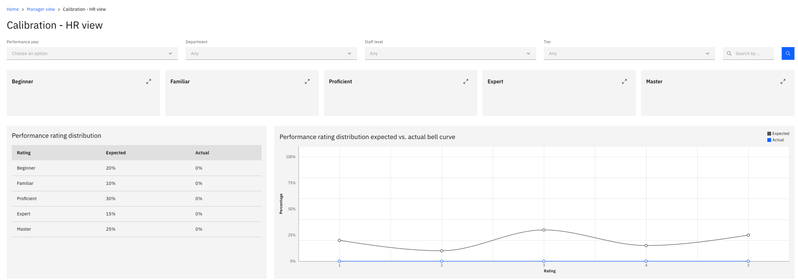
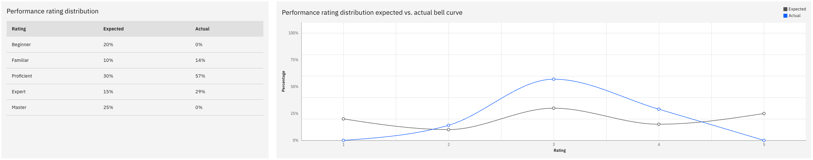
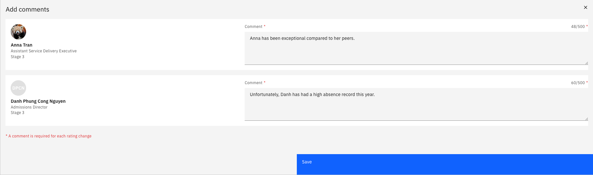
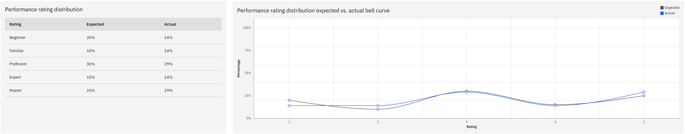

# Calibrate performance ratings

Calibration is where HR compares the ratings managers have submitted against the distribution the organisation expects, and adjusts where individuals sit relative to their peers. It is done from the HR view in ESS.

This view is only available to users with HR rights. A manager without HR access sees only the manager view.

1. Open the HR view

   In ESS, go to your manager view and switch to the **HR view** of calibration.

   

2. Filter to the group you are calibrating

   Select the **performance year** and narrow to the group you want — by department, for example. Other filters are available if you need a tighter group. Click **Search**.

3. Read the expected against actual curve

   The chart at the bottom shows the **expected** distribution against the **actual** one. Expected comes from the calibration framework set up against the performance year in D365; actual is where your employees currently sit.

   

   A band showing 30% against an expected 20% is over-represented, and an empty band is under-represented. The colour coding shows what each employee was rated against where they have ended up.

   Where the **calibrated rating** and the **provisional rating** match, no change has been made to that employee — they are sitting at the rating their manager gave them.

4. Move an employee to a different rating

   Drag an employee from one rating to another. Their **calibrated rating** updates as you drop them, while the provisional rating stays as a record of what the manager submitted.

   You can move several people before saving. The curve does not recalculate as you drag — it updates when you save.

5. Save with a comment

   Click **Save**. You are prompted for a comment against each employee you moved — for example, that the employee has been exceptional compared with their peers.

   

   The comment is written back to the employee's record in D365, so record something that explains the decision. Where you have moved several people you are prompted for each in turn.

6. Check the recalculated curve

   Once saved, the actual distribution redraws against the expected curve so you can see the effect of your changes and keep adjusting until the distribution is where you want it.

   

7. Release to the managers

   When the distribution is agreed, click **Release to manager**. The calibrated ratings go to each employee's manager, who discusses them before publishing to the employee.

   The release is recorded against each record in the calibration inquiry in D365 — see *Monitor the calibration inquiry* in the HR guide.
