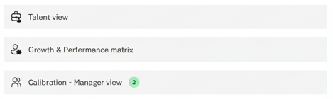
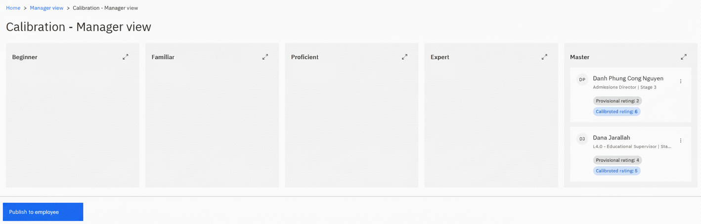

# Release calibrated ratings to your team

Once HR has calibrated, the ratings come back to you before they reach your team. This gives you the chance to see what changed and have the conversation with anyone whose rating moved, rather than them finding out from the system.

1. Open the calibration manager view

   In ESS, go to your manager view and open calibration. Your view is populated once HR has released ratings to you — before that there is nothing to see.

   

2. See which ratings changed

   The view shows the calibrated rating for each of your direct reports and which of them have changed from what you submitted. This is the list you need to work through.

3. Review an individual

   Open an employee to see their full detail — their growth and performance view, their quick profile, the rating they were given, and everything from their review: comments, training needs completed, career aspirations, PDP and PIP goals, and objectives.

   

4. Hold your conversations

   Where a rating has been downgraded or significantly uplifted after comparison against peers, speak to the employee before publishing. The point of this step is that expectations are set in a conversation rather than by a notification.

5. Publish to employees

   Once the ratings are agreed, click **Publish to employees**. The calibrated ratings are released to your team and become visible in their own performance view.

   

6. Confirm the release

   Go back into the calibration inquiry view. Your direct reports now show as released — the tick boxes against them are set once publishing completes.

   Publishing cannot be undone from this screen. Have the conversations first, then publish.
