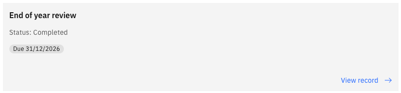
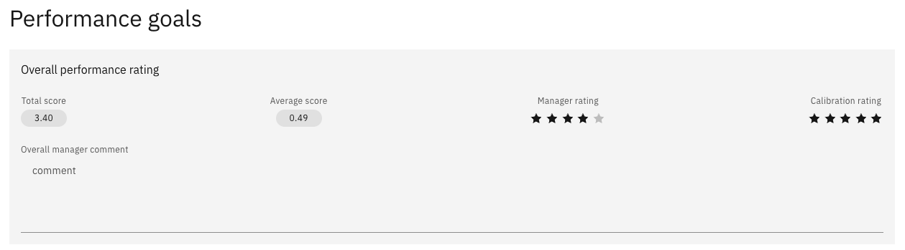

# View your calibrated rating

After you submit your end-of-year review, your manager completes their feedback and submits it for calibration. HR compares ratings across the organisation, your manager confirms the outcome with you, and the final rating is then published to you in ESS.

1. Open your performance page

   In ESS, go to **Skills and performance**.

2. Open your most recent review

   Open your latest result — your end-of-year review for the year just completed.

   

3. Read your result

   The overall view shows:

   - Your **final rating** for the year
   - Your **total score**
   - Your **average score**

   These figures are confirmed through calibration, so they reflect your final position for the year rather than a provisional one.

   

4. If your rating isn't showing yet

   Your rating appears only after your manager publishes it. Until then, your review shows as submitted, with the manager stage still in progress.

   Your manager speaks to you before publishing, particularly where a rating has changed through calibration — so the published result should not be the first you hear of it. If your rating hasn't appeared and you haven't had that conversation, speak to your manager.
