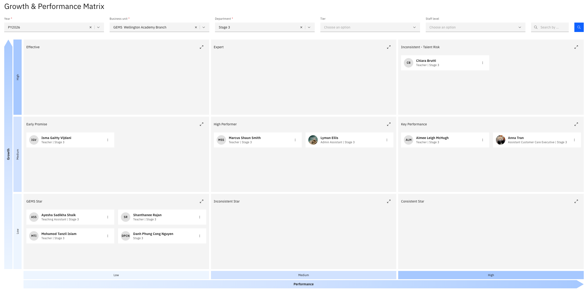
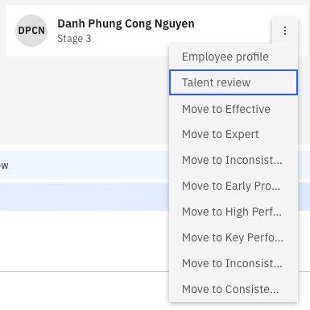

# Use the growth and performance matrix

The growth and performance matrix places your employees on a grid — GEMS star, high performer, inconsistent, talent risk and the rest — based on their performance and growth. From here, you can move people between boxes and record their talent review.

This view is restricted. It is available to users with HR access and can be limited further to suit your organisation.

1. Open the matrix

   In ESS, go to your manager view and open **Growth and performance**.

2. Filter to the employees you want

   Set your filters and click **Search**:

   | Filter | What it narrows to |
   |---|---|
   | **Year** | The performance year |
   | **Business unit** | The company or entity |
   | **Department** | The department or stage |
   | **Start level** | The level to filter from |

   Your employees are placed across the matrix according to their current position.

   

3. Move an employee

   Drag an employee from one box to another to change their position — for example, from effective to high performer. You can move people one at a time or reposition several before saving.

4. Save your changes

   Click **Save**. The positions update, and the new placement is written back to the employee's talent review record in D365.

   The update isn't instant—allow a moment, and refresh if the move doesn't appear right away.

5. Open an employee's talent review

   Click the **three dots** next to an employee and open their profile. You can view their profile information and performance rating, and open their **talent review**.

   

6. Complete the talent review

   Record against the employee:

   | Field | What to record |
   |---|---|
   | **Comments** | Your notes on the employee |
   | **Risk of loss** | How likely they are to leave — for example, medium |
   | **Impact of loss** | The effect if they did — for example, high |
   | **Position** | Their placement — key performer, high potential, or neutral |
   | **Identified successor** | Who would succeed them |
   | **Employee readiness** | How long until that successor is ready — for example, two years |

   There are other fields to complete. You can also change the employee's position here instead of dragging them on the matrix.

7. Add an attachment

   In the **File** tab, attach a supporting file if you have one. Attachments are stored against the employee's talent review record in D365.

8. Submit

   Click **Submit**. Everything you have recorded is saved to the employee's talent review and is visible to HR in D365 — see *View talent review records* in the HR guide.

   What you record here feeds the talent comparison view, so completing it properly is what makes that view useful — see [Compare talent profiles](./11-compare-talent-profiles.md).
