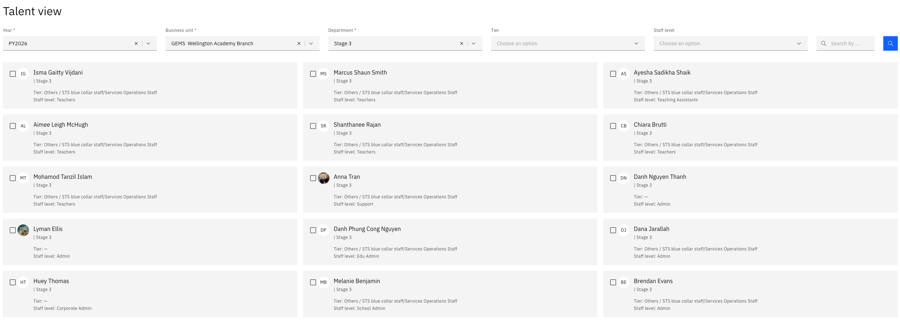
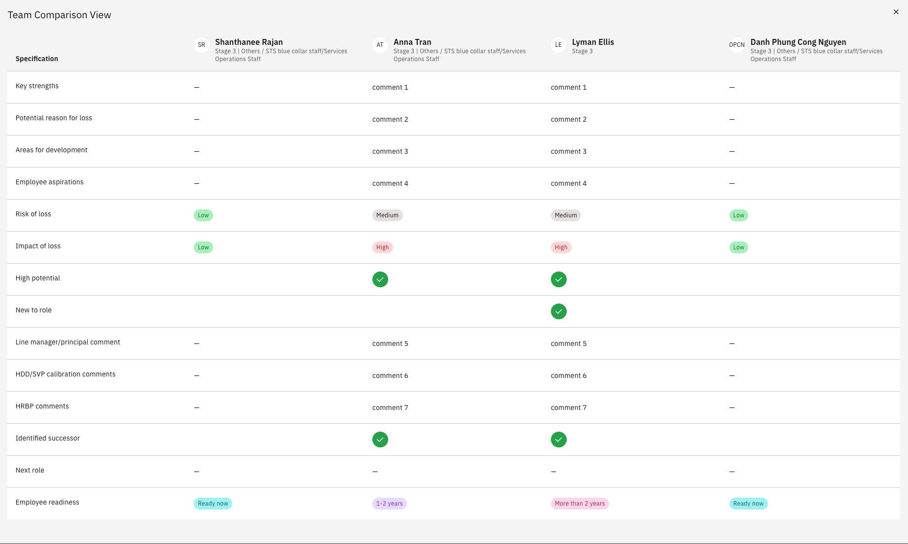

# Compare talent profiles

Talent view puts employees side by side so you can compare their talent reviews directly — useful when you are weighing succession options or looking across a department rather than at one person at a time.

1. Open talent view

   In ESS, go to your manager view and open **Talent view**.

2. Filter to the employees you want

   Set your filters — **year**, **business unit** and **department** — and click **Search**. The employees matching your filters are listed.

   

3. Select the employees to compare

   Tick the employees you want to compare.

   You can compare up to four at a time. Selecting a fifth shows a notification—this limit keeps the comparison readable instead of cramming the screen.

4. Compare

   Click **Compare**. You get a side-by-side overview of the selected employees, showing the talent review details recorded for each—comments, risk of loss, impact of loss, and high potential.

   

   The comparison only shows what has already been recorded. Employees whose talent review has not been completed appear with those fields empty — see [Use the growth and performance matrix](./10-use-the-growth-and-performance-matrix.md) to complete them.
