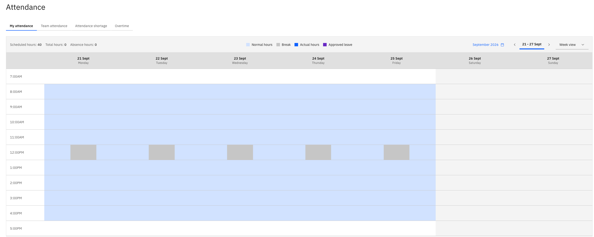
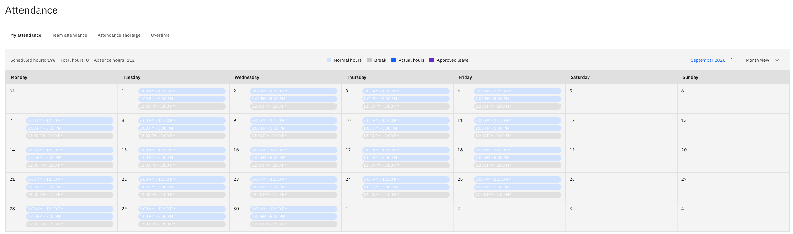

# View your attendance

Your attendance in ESS is a calendar of the days you have worked, built from the clock in and clock out records from the attendance system. It is where you check what has been recorded for you before it goes anywhere else.

1. Open attendance

   In ESS, scroll down the home page and click the **Attendance** tile.

2. Open my attendance

   The first tab is **My attendance**, showing your own record.

   

3. Choose a week

   The default is a week view. Use the week selector to move to another week.

4. Switch to the overview

   Switch to the multi-week view to see a longer period at a glance rather than one week at a time.

5. Read the calendar

   The legend at the top of the calendar tells you what each marking means. Across a month you can see your scheduled hours, how many you have booked, and your absence hours, along with the breaks that come from your working calendar and the actual hours you worked.

   

   Approved leave and public holidays appear on the calendar too — an Islamic New Year holiday, for example, comes through from the calendar and shows on the day.

If something recorded against you is wrong — a day the machine didn't register, a late arrival or an early exit that was agreed — raise it with HR. Corrections are made in D365 against your attendance log, and appear here once the system next refreshes, which is at about five minute intervals rather than instantly.
