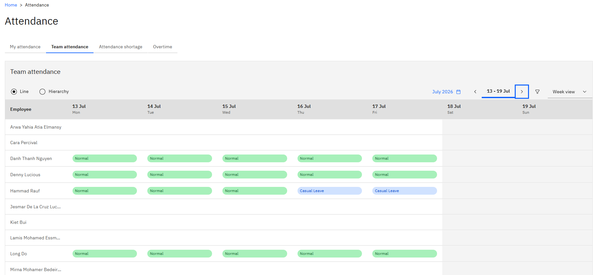

# View your team's attendance

If people report to you, the attendance area has a team tab alongside your own. It shows the same attendance information for each of them, so you can see who worked what without going into D365.

1. Open team attendance

   In ESS, open the **Attendance** tile and go to the **Team attendance** tab.

2. Choose line or hierarchy

   There are two ways people can report to you, and two views to match.

   **Line** shows your direct reports — the people whose line manager you are.

   **Hierarchy** shows the people assigned to you through the attendance hierarchy. This is how a designated attendance manager sees the people they approve attendance for, even where those people report to somebody else on the line.

   The two lists are usually different. Toggle between them to see both.

   

3. Change the period

   Move between weeks with the week selector, or widen the date range to see several weeks at once.

4. Refresh if data looks missing

   Attendance data refreshes on an interval of about five minutes rather than instantly, so a punch or a correction made moments ago may not be there yet. Refresh and check again before raising it.

From here, you can also see your team's shortages and approve their overtime — see [Review attendance shortages for your team](./03-review-attendance-shortages-for-your-team.md) and [Approve your team's overtime](./04-approve-your-teams-overtime.md).
