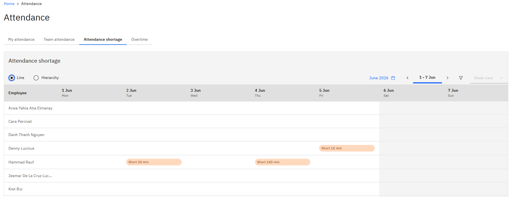

# Review attendance shortages for your team

A shortage is a day where somebody worked fewer minutes than their calendar scheduled. The attendance shortage tab collects these for your team so you can see who is short, on which days, and by how much.

1. Open the attendance shortage tab

   In ESS, open the **Attendance** tile and go to the **Attendance shortage** tab.

2. Choose Line or Hierarchy

   As with team attendance, **Line** shows your direct reports and **Hierarchy** shows the people assigned to you through the attendance hierarchy. Check both if you approve attendance for people outside your line.

3. View the shortages

   In the event of a shortage, the recorded shortage—for example, 30 minutes short on 2 June- will be listed next to the Employee name.

   

4. Act on it

   Where the shortage is genuine, take it up with the employee. If it is wrong—the biometric machine wasn't working, or there was an agreed late arrival or early exit, usually supported by an HR request—HR needs to correct it against the attendance log in D365, not in ESS. Once HR corrects it and the summary batch job runs again, the shortage clears from this view.
