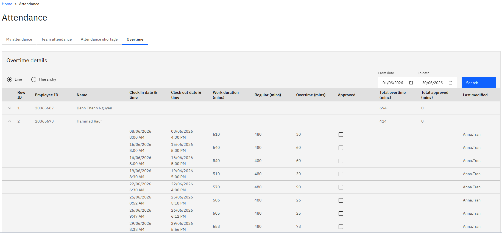
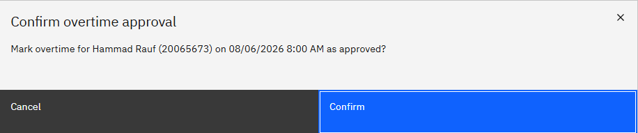
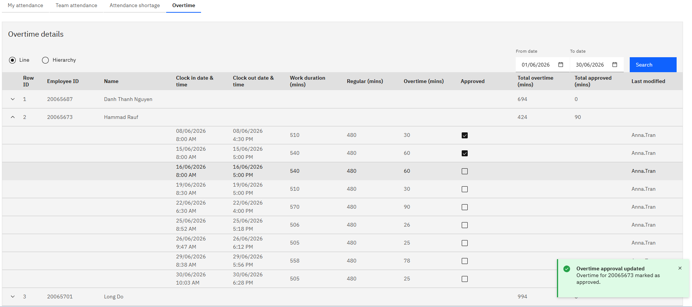

# Approve your team's overtime

Your team's overtime is raised for you to approve in ESS. Your approval is the first of three approvals — HR and finance approve after you in D365 — so nothing goes to payroll based on your approval alone.

1. Open the overtime tab

   In ESS, open the **Attendance** tile and go to the **Overtime** tab.

   

2. Choose line or hierarchy

   **Line** shows your direct reports, and **Hierarchy** shows the people assigned to you through the overtime hierarchy. Overtime approval often sits with a designated overtime manager rather than the line manager, so check the view that applies to you.

3. Check the entry

   Each line shows the clock-in and clock-out dates and times behind the overtime, so you can see at a glance what hours were actually worked before you approve them.

   Very short overruns won't be listed. HR sets a minimum number of minutes below which overtime isn't raised for approval.

4. Approve

   Click **Approve** on the line.

5. Confirm

   Confirm the action. Click **Confirm**.

   

   

6. Check the total

   Approve the other entries you agree with. The **Total approved minutes** updates as you go, so you can see the total you are signing off rather than only the individual lines.

   Your approval writes straight back to D365 — the overtime detail record there shows as approved as soon as you confirm. It then goes to HR and, after that, to finance before it is released for payroll processing.
