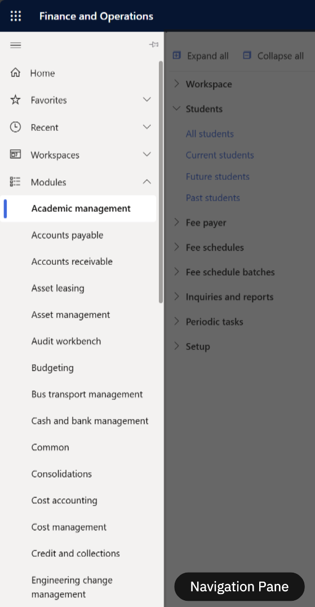
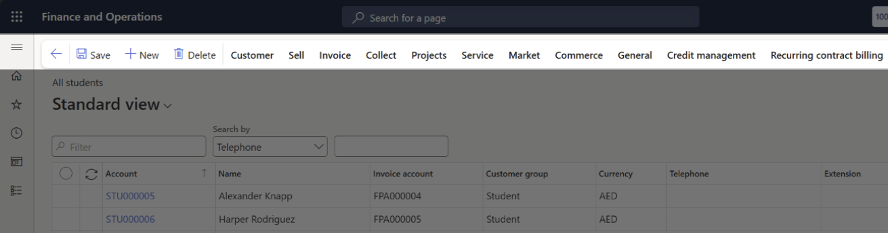

# Navigating the F&O Platform

## Basic Navigation in F&O

When you first log into Dynamics 365 F&O, the interface might feel overwhelming, but once you understand the layout, it becomes a powerful and intuitive workspace. The key to mastering navigation lies in understanding the left-hand sidebar, often referred to as the navigation pane.

### **The Navigation Pane:**
Located on the left side of the screen, this pane is your central hub for accessing everything in the system, think of it as your home base. At the top, you'll see the hamburger menu icon (☰); clicking this expands the full menu.

### **Modules:**
The heart of the system, this is where you'll find all the functional areas like Finance, Procurement, Inventory, HR, etc. Each module contains a structured set of submenus that organise tasks and features by category. Clicking into a submenu reveals specific pages or actions, like creating a journal entry or viewing a vendor list.

### **How to Navigate:**
Whenever you need to perform a new task or switch contexts:

1. Click the hamburger menu to open the navigation pane.
2. Select "Modules" to view all available functional areas.
3. Drill down into the relevant module and submenu to find the page you need.

> **Note:** *You can always return to your dashboard (the landing page) by clicking the Home icon at the top of the navigation pane. Or open a module/form from the search bar at the top of the page.*

---

## The Toolbar in F&O

Once you've navigated into a module or opened a specific page, like a vendor record, journal entry, or purchase order—you'll notice a toolbar at the top of the screen. This is called the Action Pane, and it's where most of your interaction happens.

At the far left of the Action Pane, you'll find three key buttons that are always present, no matter which page or module you're in:

| Button | Function | Why it matters |
|---|---|---|
| Back | Returns you to the previous page or list view | Keeps navigation smooth and intuitive |
| Save/Edit | Toggles between editing mode and saving changes to the current record | Lets users switch into edit mode and commit updates without hunting for controls |
| New | Creates a new record (e.g., a new invoice, customer, or journal) | Starts fresh entries without needing to re-navigate |

These buttons are anchored in place; they won't shift or disappear as you move through tabs or sections within a form. That consistency helps users stay oriented and confident, especially when multitasking or working quickly.

---
