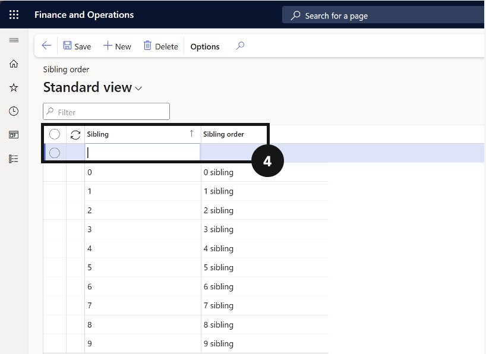
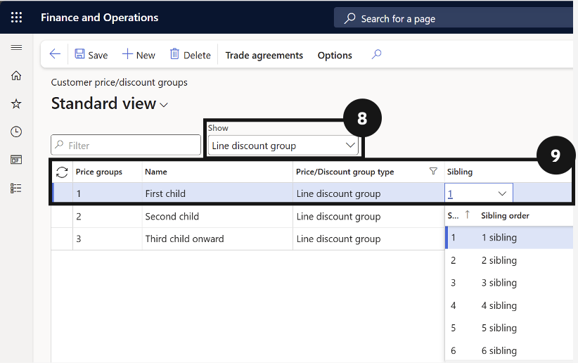

# Setup

Before fees can be generated, processed, or settled across the platform, a range of foundational settings must be configured correctly. This section covers the full scope of that setup work, including fee schedule parameters, fee and charge intervals, gender and academic year configuration, visa types, split billing percentages, fee categories, payment option setup, curriculum and stream configuration, advanced discount policies, deposit policies, sibling order and trade agreement setup, non-tuition item pricing, and the linkage of tuition fee items to academic years. Most of this configuration is completed once during initial implementation and revisited when new functionality is enabled or organisational settings change.

---

## Fee Schedule Parameters (Product)

---

## Fee Schedule Parameters (GEMS)

1. From the **FNO dashboard**, open **Modules** ▸ **Academic Management**.
2. Expand **Setup** and click **Fee schedule parameters**.
3. On the **General** tab, expand each section and complete the fields based on your school's requirements.
4. Click the **Integrations** tab.
5. Select the **Relationship type**.
   > **Note:** *Relationship type = Sibling is used for brother/sister relationships and for calculating sibling order.*
6. Select the **ID**.
7. Click the **Pro rata adjustment** tab.
8. Select the **Pro rata adjustment joining** option.
9. Select the **Pro rata adjustment leaving** option.
10. Select the **Leaving date** option:
    - *Last day attended* — use when the school manages the leaving date as LDA.
    - *Expiration date* — use when the school manages the leaving date as the expiration date in the Academic enrolment table.
11. Click the **Number sequences** tab and confirm all number sequences are set up for all references.
12. Click **Save**.

---

## Fee & Charge Interval Setup

---

## Gender Setup

1. Navigate to **Modules ▸ Academic Management ▸ Setup ▸ Gender setup**.
2. Click **New**.
3. Enter a value in the **Gender** field.
4. Enter the name in the **Name** field.

---

## Academic Year (Product)

---

## Academic Year (GEMS)

---

## Visa Types

---

## Split Percent by Fee Item

---

## Fee Categories

1. From the **FNO dashboard**, open **Modules** ▸ **Academic Management**.
2. Expand **Setup** and click **Fee categories**.
3. Click **New** in the top toolbar.
4. Complete the columns to create new fee categories.
5. Click **Save**.
6. Link these fees to the product master by navigating to **Modules ▸ Product information management ▸ Products ▸ Released products**.
7. Use the **Item number** filter to search for the added fee categories.  
   > **Note:** Categories related to Academic Management start with the letters **AM**.
8. Select the category, then scroll down and expand the **Sell** tab.
9. Locate **Activity ▸ Fee category**.
10. Ensure the fee aligns with the category it will be billed as.

---

## Payment Option Setup

---

## Curriculum

---

## Intercompany Journal (GEMS)

---

## Advanced Discount Policy (GEMS)

---

## Stream

---

## Deposit Policy

---

#### Sibling Order
The sibling discount feature allows the school to automatically apply fee reductions based on how many children from the same family are currently enrolled. To make this work, each student needs to be assigned a sibling order number that reflects their position within the family, with the eldest being 1, the second child being 2, and so on. These numbers are then mapped to customer price and discount groups, which are in turn linked to trade agreements that define the discount percentage for each sibling position. Once this configuration is complete and the trade agreement is posted, the system applies the correct discount automatically when fee invoices are generated.

---

## Sibling Order Setup

> **Note:** *For each possible child in a family, assign a sibling order number (e.g., 1 for first child, 2 for second, up to your maximum, such as 9). Use 0 for students who are not yet current (e.g., future students or those transitioning between programs).*

1. From the **FNO dashboard**, open **Modules** ▸ **Academic Management**.
2. Expand **Setup** and click **Sibling order**.
3. Click **New** to create sibling order entries.
4. In the first column enter the **sibling order number** and in the second column, enter the **description**.
5. Click **Save**.
6. Go back to **Modules** ▸ **Sales and marketing**.
7. Expand **Prices and discounts** and click **Customer price/discount groups**.
8. In the Show field, change the value to **Line discount group**.
9. Click **New** to assign the correct sibling order and complete the following columns:
   - Enter the sibling order number in the Price groups column (e.g., 1, 2, 3).
   - Name the entry in the next column (e.g., First Child, Second Child).
   - In the Sibling column, use the dropdown and match this with the sibling order.
10. Repeat as many times as required.
11. Click **Save**.
    

---

## Trade Agreement

1. From the **FNO dashboard**, open **Modules** ▸ **Sales and marketing**.
2. Expand **Prices and discounts** and click **Trade agreement journals**.
3. Click **New**.
4. In the **Name** column, select Sibling discount.
5. Change view to **Lines**.
6. Click **New** and complete the following columns:
   - Change **Party code type** to Group.
   - Set **Account selection** to the number of siblings (e.g., First child).
   - Change **Product code** type to Group.
   - Set **Item relation** to Sibling discount.
7.  In Details, set the policy **start and end date**.
     > **Note:** *Leave the end date blank to run the discount indefinitely.*
8. Enter the discount amount in **Discount percentage 1** (e.g., 10.00 for 10%).
9. Click **New** to add the second child discount; repeat these steps as needed.
10. Click **Save**.
11. Click **Post** to activate the trade agreement policy.
12. Go back to **Modules** ▸ **Product information management**.
13. Expand **Products** and click **Released products**.
14. Open each **line** related to tuition.
15. On the next screen, expand the **Sell** section.
16. Scroll down to the **Line discount group** dropdown and choose the Sibling discount trade agreement.
17. Click **Save**.
18. Repeat for other tuition fee items.

---

## Pre-Admission Posting Setup

---

## Customer Integration Mapping

---

## Fee Type

---

## Receipt Intercompany Mapping

---

## Fee Master Template to Sync Items to CE

---

## Non-Tuition Item Price Setup 

1. From the **FNO dashboard**, open **Modules** ▸ **Sales and marketing**.
2. Expand **Prices and discounts** and click **Trade agreement journals**.
3. Click **New** to create a new trade agreement journal.
4. In the **Name** field, select the **standard journal name** (without academic attributes enabled).
5. Click **Lines**.
6. Complete the required fields.
7. Click **Add products** and repeat step 6 for each item.
8. Click **Post**.

> **Note:** *Non-tuition items such as ID cards use a standard trade agreement. Academic attributes are not required and should not be selected for these items.*

---

## Link Tuition Fee Item to Academic Year

> **Note:** *This step is required for enrolment deposit calculations. The system uses this link to identify which item is the tuition fee item and look up the correct annual price from the trade agreement.*

1. From the **FNO dashboard**, open **Modules** ▸ **Academic Management**.
2. Expand **Setup** and click **Academic year**.
3. Select the relevant **academic year** record.
4. Click **Tuition fee items**.
5. Click **New** in the tuition fee items section.
6. Complete the columns to link Tuition Fees to an Academic Year.
7. If a second tuition fee item exists for the other student type, click **New** and repeat that item.
8. Repeat steps 3–8 for each additional academic year.
9. Click **Save**.

---
