# Setup

Before fees can be generated, processed, or settled across the platform, a range of foundational settings must be configured correctly. This section covers the full scope of that setup work, including fee schedule parameters, fee and charge intervals, gender and academic year configuration, visa types, split billing percentages, fee categories, payment option setup, curriculum and stream configuration, advanced discount policies, deposit policies, sibling order and trade agreement setup, non-tuition item pricing, and the linkage of tuition fee items to academic years. Most of this configuration is completed once during initial implementation and revisited when new functionality is enabled or organisational settings change.

---

## Fee Schedule Parameters (Product)

1. From the **FNO dashboard**, open **Modules** ▸ **Academic management**.​
2. Expand **Setup** and click **Fee schedule parameters**.​
3. On the **General** tab, expand each section and complete the fields based on your school’s requirements. This includes:​
    - Deposit handling journals for refund and forfeit​
    - Payment journals for online, over-the-counter, miscellaneous​
    - User group permissions for generated sales orders​
    - Staff concession cancellation and adjustment setup​
   > **Note:** *All journals used in this setup must already exist in the system. The selected user group controls who can edit generated sales orders. Staff concession settings apply when a staff contract ends.​*
4. In **Financial activities to Student**:​
    - Select **No** when posting financial transactions to the **Fee payer account**​
    - Select **Yes** when posting financial transactions directly to the **student account**​
5. Click the **Integrations** tab.​
6. Select the **Relationship type** field, select **Financial responsibility**, then **Sibling**.​
   > **Note:** *Financial responsibility is used for parents or guardians who pay fee invoices. Sibling is used for brother/sister relationships and for calculating sibling order in fee calculations.* ​
7. Select the **ID value** that matches the configured relationship type.​
8. Click the **Pro rata adjustment** tab.​
9. Select the **Pro rata adjustment joining** option.​
10. Select the **Pro rata adjustment leaving** option.​
11. Select the **Leaving date** option:​
    - *Last day attended* — use when the school manages the leaving date as LDA.​
    - *Expiration date* — use when the school manages the leaving date as the expiration date in the Academic enrolment table.​
12. Click the **Number sequences** tab and confirm all number sequences are set up for all references.​
13. Click **Save**.

_1.png)

_2.png)

---

## Fee Schedule Parameters (GEMS)

1. From the **FNO dashboard**, open **Modules** ▸ **Academic management**.
2. Expand **Setup** and click **Fee schedule parameters**.
3. On the **General** tab, expand each section and complete the fields based on your school's requirements.
4. Click the **Integrations** tab.
5. Select the **Relationship type**.
   > **Note:** *Relationship type = Sibling is used for brother/sister relationships and for calculating sibling order.*
6. Select the **ID**.
7. Click the **Pro rata adjustment** tab.
8. Select the **Pro rata adjustment joining** option.
9. Select the **Pro rata adjustment leaving** option.
10. Select the **Leaving date** option:
    - *Last day attended* — use when the school manages the leaving date as LDA.
    - *Expiration date* — use when the school manages the leaving date as the expiration date in the Academic enrolment table.
11. Click the **Number sequences** tab and confirm all number sequences are set up for all references.
12. Click **Save**.

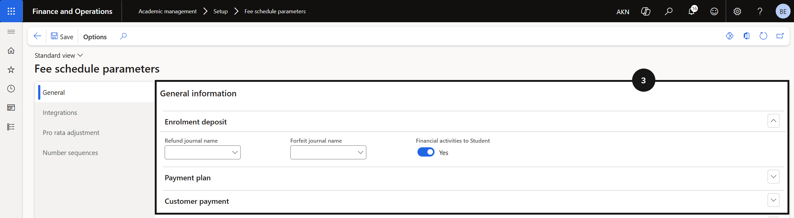

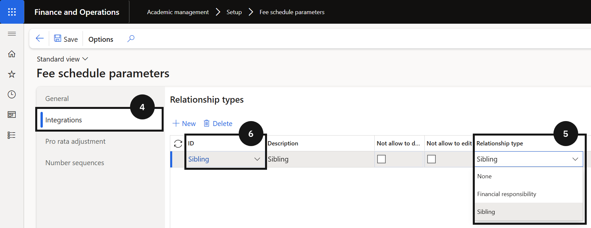

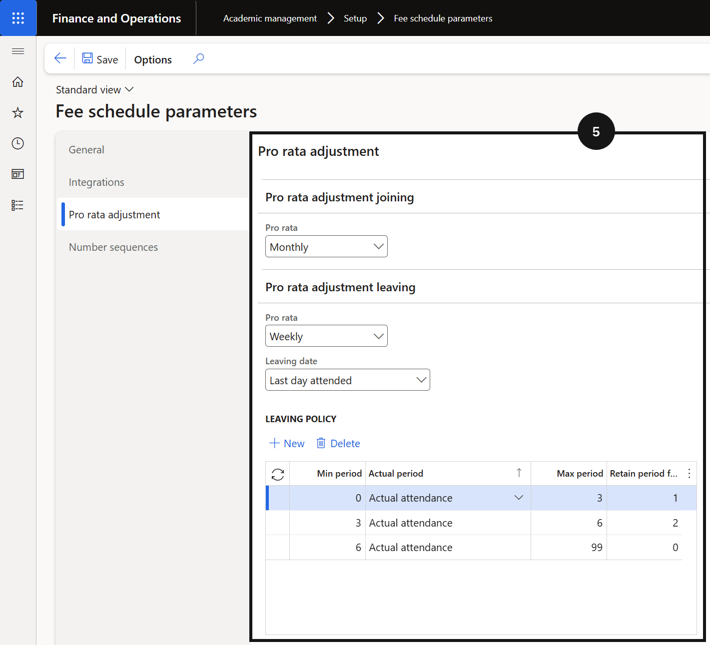

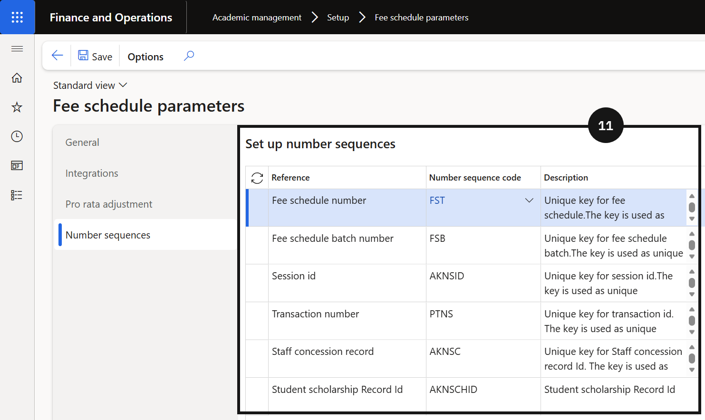

---

## Fee & Charge Interval Setup

1. From the **FNO dashboard**, open **Modules** ▸ **Academic management**.
2. Expand **Setup** and click on **Fee and Charge Interval**.
3. Click **New** in the toolbar to create a new interval.
4. Enter details in **Fee generation interval ID** (e.g., 2025-2026).
5. Enter details in the **Description** field.
6. Enter the **Start date** and **End date** for the school academic year (billing cycle).
7. **Choose the Period option** from the dropdown (e.g., Month, Week) based on the school’s pricing method.
8. Enter the **Number of intervals** to specify how many invoices will be generated in the academic year (e.g. 3 for termly fees, or 10 for monthly). This should match the school’s billing frequency.
9. Click **Generate** in the toolbar to create the periods.
10. For each period:
    - Enter details in **Period description**.
    - Enter the **Start date** and **End date**.
    - Click **Update unit quantity** so the system calculates the number of months or weeks within the period.
      > **Note:** *The number appears in the Unit quantity field and can be edited to remove the decimal.*
    - Enter the **Due date** to define when payment is expected.
    - Enter the **Revenue recognition date** if required for deferral.
      > **Note:** *The due dates and revenue recognition dates will be reflected in related sales orders and reports.*
11. Click **Weeks** in the Periods toolbar, then click the **Generate** button to automatically populate the weeks’ start and end dates for each period. This is only required for pro-rata joining and leaving policies.
12. Click **Months** in the Periods toolbar, then click the **Generate** button to automatically populate the months’ start and end dates for each period.
13. Validate entered data for accuracy, then click **Save**.

---

## Gender Setup

1. Navigate to **Modules ▸ Academic management ▸ Setup ▸ Gender setup**.
2. Click **New**.
3. Enter a value in the **Gender** field.
4. Enter the name in the **Name** field.

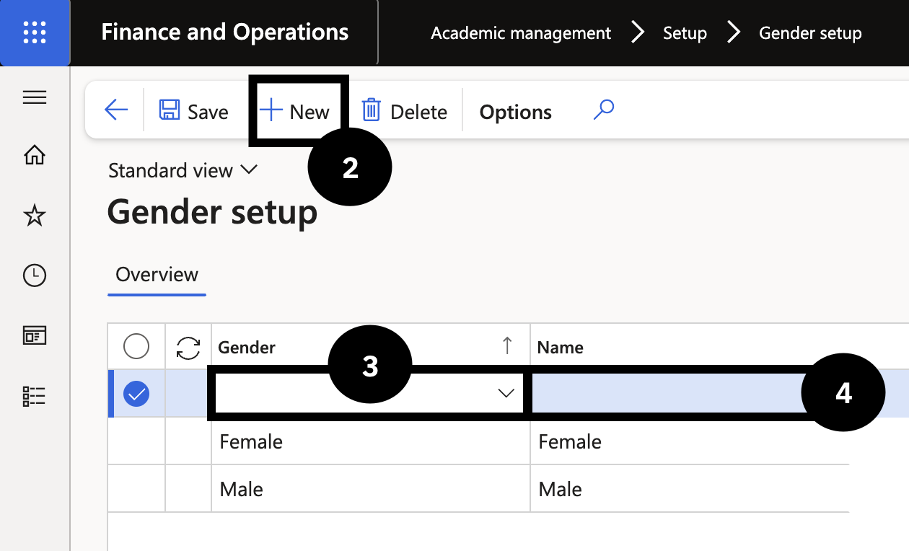
---

## Academic Year (Product)

1. Navigate to **Modules ▸ Academic management ▸ Setup ▸ Academic year**.
2. Click **New**.  
   > **Note:** *The **Sequence order** will be automatically filled in.*
3. Add a **Description** (grade level), **School level dimension**, and **Yeargroup dimension**.
4. Click **Save**.
5. Select **Tuition fee items** from the Action Pane.
6. Click **New**.
7. Select **Tuition fee** from the **Item number** field.
8. Enter **Year** in the **Unit** field.
9. Close the page.
10. To check, navigate to **Academic management ▸ Students ▸ All students**.
11. Select a student from the list to see which grade they are enrolled in.
    > **Note:** *If you select **Academic** from the Action Pane ▸ **Academic enrolments**, you can view all the years or grades the student has been enrolled in at the school.* 

_1.png)

_2.png)

---

## Academic Year (GEMS)

---

## Visa Types

1. From the **FNO dashboard**, open **Modules** ▸ **Academic management**.
2. Expand **Setup** and click **Visa types**.
3. Click **New** in the toolbar.
4. Complete the columns to create a new Visa type.
5. Select **Full fee paying** if the student is not subsidised and must pay the full tuition fee.
6. Clear the **Active** box if the visa is no longer valid. 
7. Click **Save**.

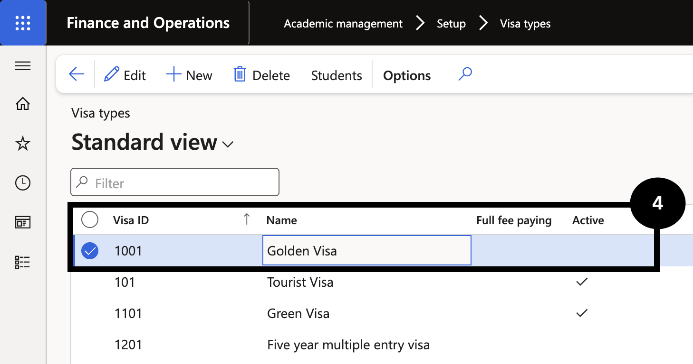

---

## Split Percent by Fee Item

> **Note:** *Prepare the student account number first.*

1. Navigate to **Modules** ▸ **Academic management** ▸ **Fee schedules** ▸ **All fee schedules**.
2. Click **New**.
3. Add a **Description** into the field (e.g., Split Billing)
4. Select the **Billing interval** from the dropdown.
5. If applicable, enable **Early payment discount**.
6. In **Fee schedule lines** add a line by clicking **+ Add line**.
7. In the **Item number** field, select a fee item from the dropdown (e.g., Tuition fee).
8. Select the **Condition** field.
9. Define the condition by clicking **Condition** in the line above.
10. Select the condition and add the **Criteria** and click **OK**.
11. Add another line by clicking **+ Add line**.
12. In the **Item number** field, select a different fee item from the dropdown (e.g., Building fund fee).
    > **Note:** *There is no need to set a condition for Building fund fee, it is preset.*
13. Click **Save**.
14. Navigate to **Modules** ▸ **Academic management** ▸ **Setup** ▸ **Split percent by fee items**.
15. Add a **New** record.
16. Identify the student either by using the filter function from the **Student account** field or the **Student name** field.
17. Select **Building fund fee** in the **Fee item** field.
18. Select the fee payer from the **Fee payer account** dropdown.
19. Input the percentage in **Paid percentage**.
    > **Note:** *The payment amount should differ from the amount in the student setup.
20. Add the **Effective date** and **Expiration date**.
21. Add a **New** line.
22. Repeat steps 17-20 with a different payer and the remaining percentage.
23. Click **Save**.
24. To generate a Sale audit for the student, navigate to **Modules** ▸ **Academic management** ▸ **Periodic tasks** ▸ **Generate sales order batch processing**.
25. Add the **batch description** to include the student's name.
26. Expand **Records to include (Customers)**.
27. Select the **Filter**.
28. In the **Field**, select **Student account**.
29. Fill in the **Criteria** with the student account number. Click **OK**.
30. Expand **Records to Include (Fee schedule templates)**.
31. Select the **Filter**.
32. Select the fee schedule number (split billing override template) from the **Criteria** dropdown.
33. In **Run in the background**, select **Yes** below **Batch processing**.
34. Click **OK**.
35. To validate, navigate to **Modules** ▸ **Academic management** ▸ **Fee schedule batches** ▸ **All fee schedule batches**.
36. Select the **Fee schedule batch number** to view the fee items with a different split percentage.

!

---

## Fee Categories

1. From the **FNO dashboard**, open **Modules** ▸ **Academic management**.
2. Expand **Setup** and click **Fee categories**.
3. Click **New** in the top toolbar.
4. Complete the columns to create new fee categories.
5. Click **Save**.
6. Link these fees to the product master by navigating to **Modules ▸ Product information management ▸ Products ▸ Released products**.
7. Use the **Item number** filter to search for the added fee categories.  
   > **Note:** *Categories related to Academic management start with the letters AM.*
8. Select the category, then scroll down and expand the **Sell** tab.
9. Locate **Activity ▸ Fee category**.
10. Ensure the fee aligns with the category it will be billed as.

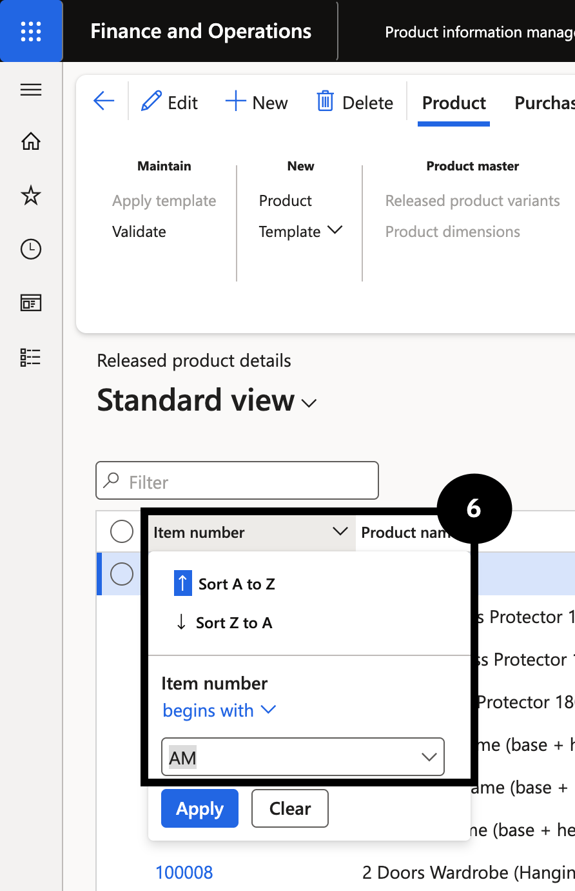

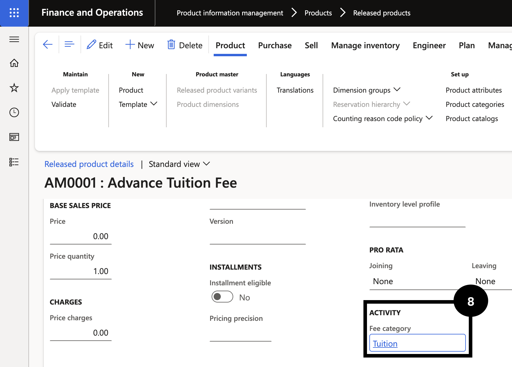

---

## Payment Option Setup

1. Navigate to **Modules ▸ Academic management ▸ Setup ▸ Payment option setup**.
2. Click **New**.
3. Select the **Payment plan** from the dropdown.
4. Fill in the **Payment option** and **Description** fields.
    >**Note:** *Once saved, there will be a copy on the Customer master or the Student master*
5. Click **Save**.

---

## Curriculum

1. From the **FNO dashboard**, open **Modules** ▸ **Academic management**.
2. Expand **Setup** and click on **Curriculum**.
3. Click **New** in the toolbar to create a new curriculum.
4. Choose the **Curriculum** option from the dropdown (e.g., AM).
5. Enter details in the **Description** field.
6. Select the **Curriculum dimension** from the dropdown.
7. Click **Save**.

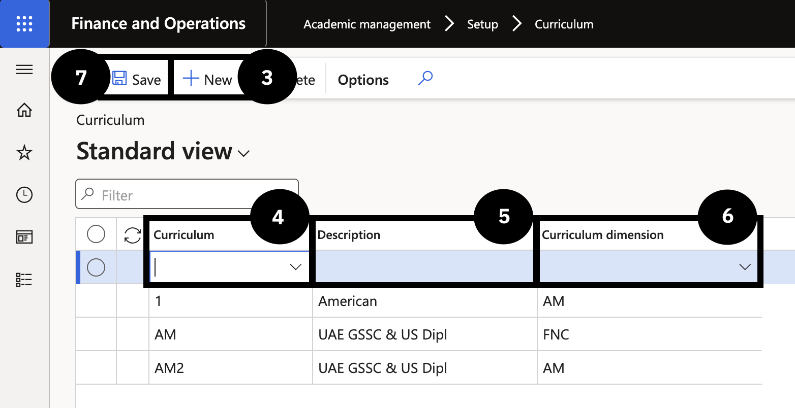

---

## Intercompany Journal (GEMS)

1. Navigate to **Academic management ▸ Setup ▸ Cashier Receipt ▸ Receipt intercompany mapping**.
2. Click **New**.
3. Select the **Method of payment** from the dropdown.
    > **Note:** *Choose the method of payment that has an Intercompany journal with the other schools.*
4. Select the **Destination school** from the dropdown.
    > **Note:** *The selected school will have an Intercompany journal when the cashier journal is posted.*
5. Set the **Account type** and the **Account** fields based on the entry posting in the original cashier receipt:
   - If the **Account type** is Ledger, select Main in the **Account** field
   - If the **Account type** is Bank, select Bank account in the **Account** field
6. Select a value in the **Intercompany journal** field.
7. Click **Save**.
    
  > **Note:** *When the cashier journal is posted, the selected Destination school will have the intercompany journal created according to the configured Method of payment, Account type/Account, and Intercompany journal selection.*

_1.png)

---

## Advance Discount Policy (GEMS)

1. Navigate to **Academic management ▸ Setup ▸ Advance discount policy**.
2. Click **New**.
3. Type a value in the **Policy code** field.
4. Enter or select a value from the **Fee and charges interval** dropdown.
    > **Note:** *Select the billing cycle that applies to this policy.*
5. Click the **General** tab.
    >**Note:** *The **Fee and charges interval** field will fill automatically.*
6. In the **Period name** field, select the relevant time period.
    > **Note:** *More than one time period may be selected in this field.*
7. Click **Select**.
8. Return to the **Overview** tab.
9. In the **Charges code** field, select **Advance Discount**.
10. Enter the discount value into the **Discount** field.
11. In the **From date** and **To date** fields, enter the time period that the advance discount will be applied.
12. Complete the **Description** field for reporting reference.
13. Click **Save**.

_1.png)

_2.png)

_3.png)

---

## Stream

1. From the **FNO dashboard**, open **Modules** ▸ **Academic management**.
2. Expand **Setup** and click on **Stream**.
3. Click **New**.
4. Enter details in the **Stream** column.
5. Enter details in the **Description** column.
6. Click **Save**.

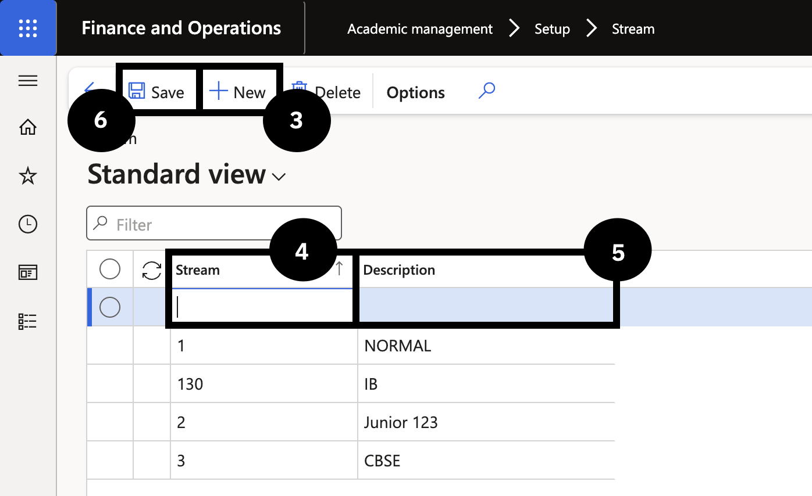

---

## Deposit Policy

1. From the **FNO dashboard**, open **Modules** ▸ **Academic management**.
2. Expand **Setup** and click on **Deposit policy**.
3. Click **New** in the toolbar to create a deposit policy record.
4. In **Pre-admission type** select the appropriate deposit from the dropdown.
5. Select the **Deposit type** from the dropdown (e.g., Percent or Fixed).
6. Enter the **Value** amount in the column section for the selected deposit type.
7. Repeat steps 3-6 for each deposit type you need to set up.
8. Click **Save**.
    > **Note:** *If using the percentage deposit type, the percentage is calculated from the tuition fee linked to the selected academic year.*

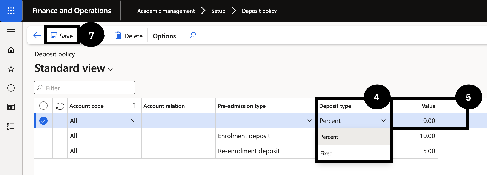

---

#### Sibling Order
The sibling discount feature allows the school to automatically apply fee reductions based on how many children from the same family are currently enrolled. To make this work, each student needs to be assigned a sibling order number that reflects their position within the family, with the eldest being 1, the second child being 2, and so on. These numbers are then mapped to customer price and discount groups, which are in turn linked to trade agreements that define the discount percentage for each sibling position. Once this configuration is complete and the trade agreement is posted, the system applies the correct discount automatically when fee invoices are generated.

---

## Sibling Order Setup

> **Note:** *For each possible child in a family, assign a sibling order number (e.g., 1 for first child, 2 for second, up to your maximum, such as 9). Use 0 for students who are not yet current (e.g., future students or those transitioning between programs).*

1. From the **FNO dashboard**, open **Modules** ▸ **Academic management**.
2. Expand **Setup and Sibling setup**, then click **Sibling order**.
3. Click **New** to create sibling order entries.
    > **Note:** *Add a new record only if your school needs more sibling positions than the ones already listed.*
4. Enter a unique number in **Sibling discount order** column (e.g, 11). Follow your school's sequencing convention. 
5. Enter the **Sibling order** description (e.g., 11th Child). Use the same pattern as existing records.
6. Click **Save**.

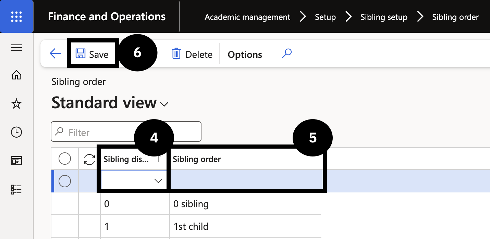    

---

## Trade Agreement

1. From the **FNO dashboard**, open **Modules** ▸ **Sales and marketing**.
2. Expand **Prices and discounts** and click **Trade agreement journals**.
3. Click **New**.
4. In the **Name** column, select Sibling discount.
5. Change view to **Lines**.
6. Click **New** and complete the following columns:
   - Change **Party code type** to Group.
   - Set **Account selection** to the number of siblings (e.g., First child).
   - Change **Product code** type to Group.
   - Set **Item relation** to Sibling discount.
7.  In Details, set the policy **start and end date**.
     > **Note:** *Leave the end date blank to run the discount indefinitely.*
8. Enter the discount amount in **Discount percentage 1** (e.g., 10.00 for 10%).
9. Click **New** to add the second child discount; repeat these steps as needed.
10. Click **Save**.
11. Click **Post** to activate the trade agreement policy.
12. Go back to **Modules** ▸ **Product information management**.
13. Expand **Products** and click **Released products**.
14. Open each **line** related to tuition.
15. On the next screen, expand the **Sell** section.
16. Scroll down to the **Line discount group** dropdown and choose the Sibling discount trade agreement.
17. Click **Save**.
18. Repeat for other tuition fee items.

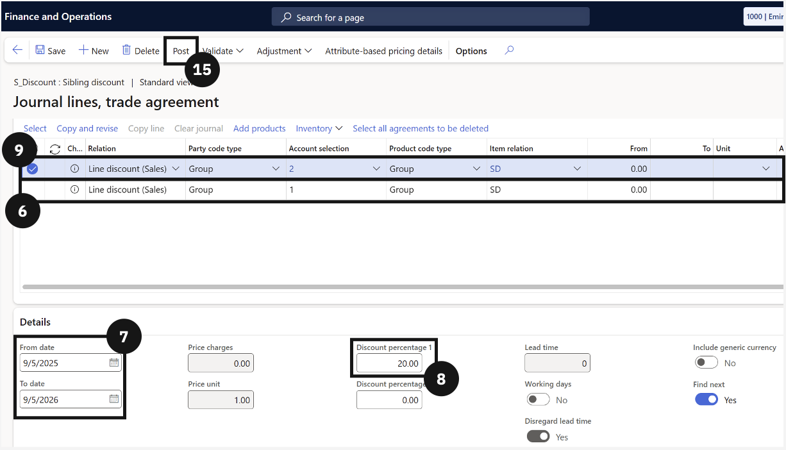

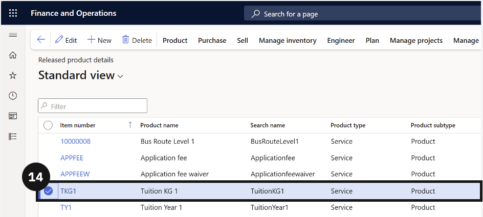

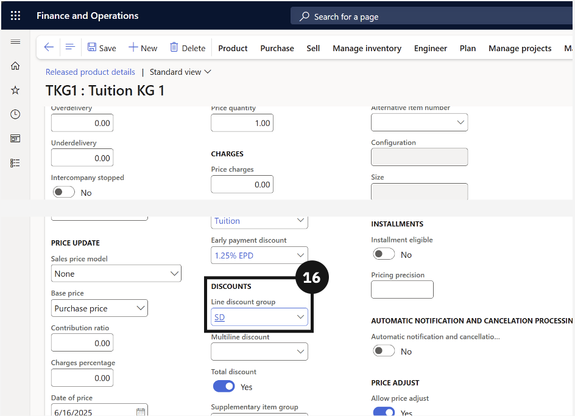

---

## Pre-Admission Posting Setup

1. From the FNO dashboard, open **Modules** ▸ **Academic management**.
2. Expand **Setup**, then expand **Pre‑admission fees**.
3. Click **Pre‑admission posting**.
4. Click **New** in the toolbar to create a pre-admission posting entry.
5. Select a value in **Pre-admission type** (e.g., Application fee, Enrolment fee).
6. Select a value in **Account entry** (e.g., Sales order, Free text invoice, General journal).
7. Select a value in **Posting profile**. 
8. Select a value in **Receipt journal name** that applies to online payments for this admission type.
9. Select a unique value in **Sales category**. Do not use the same sales category for multiple pre-admission types.
10. Select a value in **Item number**. This is required only for application or registration fees.
11. Click **New** to add another pre-admission type, such as Enrolment Deposit or Re-enrolment Deposit.
12. Enter the required values for each column in the table.
    > **Note:** *For Enrolment Deposit and Re-enrolment Deposit types, do not select an item number. The system generates an open sales order header for fee generation.* 
13. Click **Save**.

---

## Customer Integration Mapping

1. Navigate to **Modules ▸ Academic management ▸ Setup ▸ Integration ▸ Report type**. 
2. Click **New**. 
3. Fill in the **Record type** and **Description fields**. 
4. Click **Save** and close the page. 
5. Navigate to **Modules Academic management ▸ Setup ▸ Integration ▸ Customer integration mapping**. 
6. Click **New**. 
7. Select the **Record type** from the dropdown. 
    > **Note:** *The Record type description should fill in automatically.* 
8. In the **Customer type** field, select between Student and Fee payer. 
9. Select the appropriate **Customer group** from the dropdown. 
10. Click **Save**.

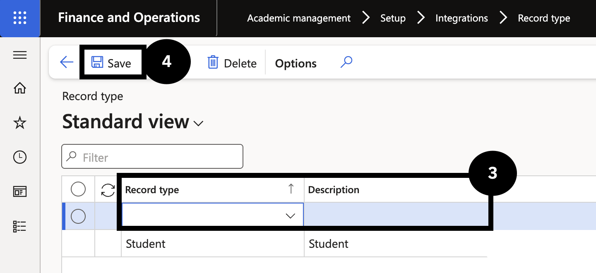

---

## Fee Type

1. From the **FNO dashboard**, open **Modules** ▸ **Academic management**.
2. Expand **Setup**, then expand **Cashier receipt**.
3. Click **Fee type**. Review the list of existing fee types to avoid creating duplicates.
4. Click **New** in the toolbar.
    > **Condition:** *Perform this step only if the required fee type does not exist.*
5. Enter a value in the **Fee type** field (e.g., Security deposit, Transport).
6. Enter the required information for each column in the table as needed by your organisation.
7. Click **Save**.
    > **Note:** *The fee type is configured in advance and can be selected when creating cashier receipts and miscellaneous receipts. The system then automatically populates the payment type, financial dimensions, and accounting postings related to that fee category.*

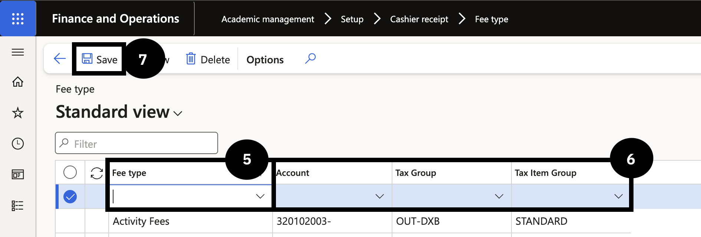

---

## Receipt Intercompany Mapping

1. From the **FNO dashboard**, open **Modules** ▸ **Academic management**.
2. Expand **Setup**, then expand **Cashier receipt**.
3. Click **Receipt intercompany mapping**.
4. Click **New** in the toolbar.
5. Select the **Method of payment** from the dropdown (e.g., CobOn).
    > **Note:** *Choose the method of payment that has an intercompany journal with the destination school.*
6. Select the **Destination school** from the dropdown.
7. Set the **Account type** and the **Account** fields based on the entry posting in the original cashier receipt:
   - If the **Account type** is Ledger, the **Account** is Main
   - If the **Account type** is Bank, the **Account** is Bank account
8. Select a value in the **Intercompany journal** field.
9. Click **Save**.
    
  > **Note:** *When the cashier journal is posted, the selected Destination school will have the intercompany journal created according to the configured Method of payment, Account type/Account, and Intercompany journal selection.*

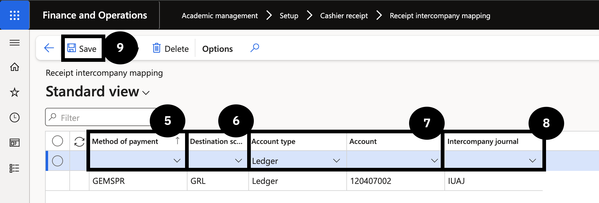

---

## Fee Master Template to Sync Items to CE

> **Note:** *This setup creates a fee master list template that determines the fee items synced from D365 F&O to CE for inclusion in student offer letters.*

1. From the **FNO dashboard**, open **Modules** ▸ **Academic management**.
2. Expand **Setup**, then click **Fee master list template**.
3. Click **New** in the toolbar.
4. Enter values in the **Code** and **Name** fields.
5. Enter the date in the **Effective date** field.
6. In Products section, click **+ Add** in the toolbar.
7. Select an **Item number** from the dropdown to sync the selected fee item to D365 CE.
8. Set Quantity to 1 in the **Quantity** field.
9. Select annual option in the **Unit** field.
10. In the **Switch view** field, select **All**, then select your template row.
11. Click **Save**.
    > **Note:** *Next steps show how to assign to the Academic year.*
12. Go back to **Modules** ▸ **Academic management**.
13. Expand **Setup**, then click **Academic year**.
14. Select the **Academic year** row. Then select the **Fee master list** code from the dropdown.
15. Repeat step 14 for each academic year.
16. Click **Save**.

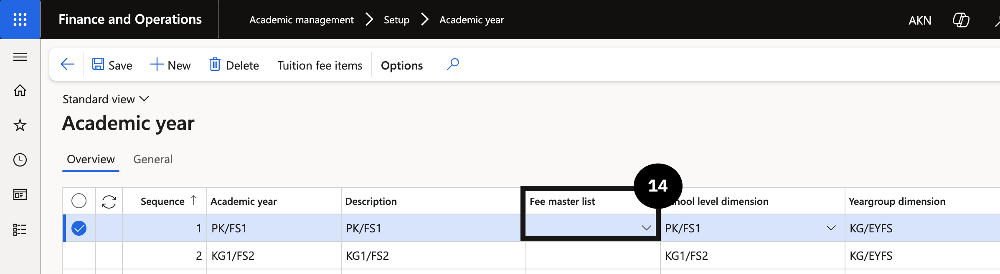

---

## Non-Tuition Item Price Setup 

1. From the **FNO dashboard**, open **Modules** ▸ **Sales and marketing**.
2. Expand **Prices and discounts** and click **Trade agreement journals**.
3. Click **New** to create a new trade agreement journal.
4. In the **Name** field, select the **standard journal name** (without academic attributes enabled).
5. Click **Lines**.
6. Complete the required fields.
7. Click **Add products** and repeat step 6 for each item.
8. Click **Post**.

> **Note:** *Non-tuition items such as ID cards use a standard trade agreement. Academic attributes are not required and should not be selected for these items.*

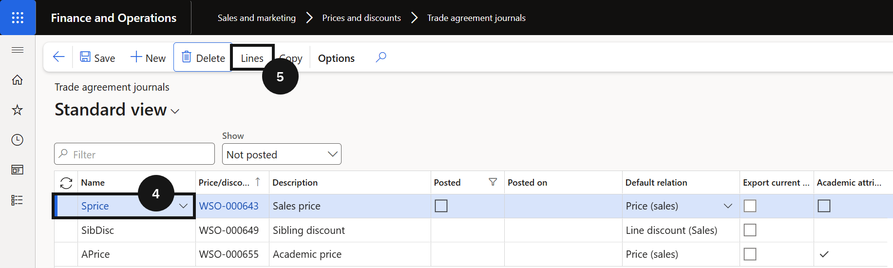

---

## Link Tuition Fee Item to Academic Year

> **Note:** *This step is required for enrolment deposit calculations. The system uses this link to identify which item is the tuition fee item and look up the correct annual price from the trade agreement.*

1. From the **FNO dashboard**, open **Modules** ▸ **Academic management**.
2. Expand **Setup** and click **Academic year**.
3. Select the relevant **academic year** record.
4. Click **Tuition fee items**.
5. Click **New** in the tuition fee items section.
6. Complete the columns to link Tuition Fees to an Academic Year.
7. If a second tuition fee item exists for the other student type, click **New** and repeat that item.
8. Repeat steps 3–8 for each additional academic year.
9. Click **Save**.

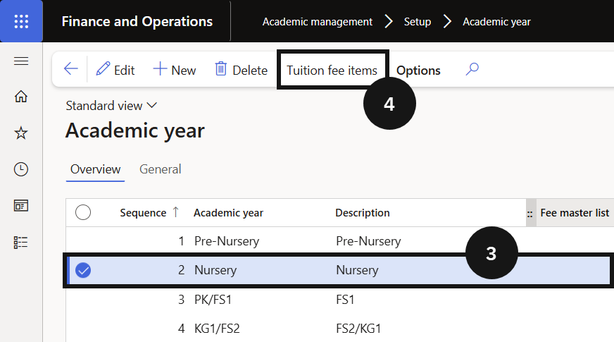

---
