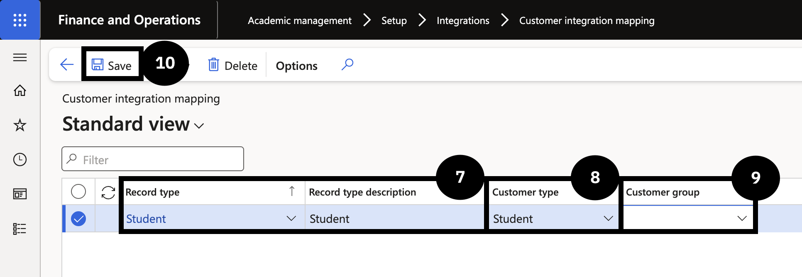

# Configure Customer Integration Mapping

This process defines how customer data is mapped and synchronised between the source system and Dynamics 365 Finance and Operations, classifying records into the correct customer type — Student or Fee payer — based on configuration.

1. Create a Report type

   From the **FNO dashboard**, navigate to **Modules ▸ Academic management ▸ Setup ▸ Integration ▸ Report type**. Click **New**, fill in the **Record type** and **Description** fields, then click **Save** and close the page.

2. Configure Customer integration mapping

   Navigate to **Modules ▸ Academic management ▸ Setup ▸ Integration ▸ Customer integration mapping**. Click **New** and complete the following:

   - **Record type** — select from the dropdown. The Record type description fills in automatically.
   - **Customer type** — select *Student* or *Fee payer*.
   - **Customer group** — select the appropriate group from the dropdown.

3. Save

   Click **Save**.

