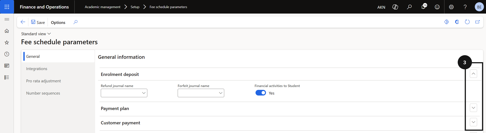
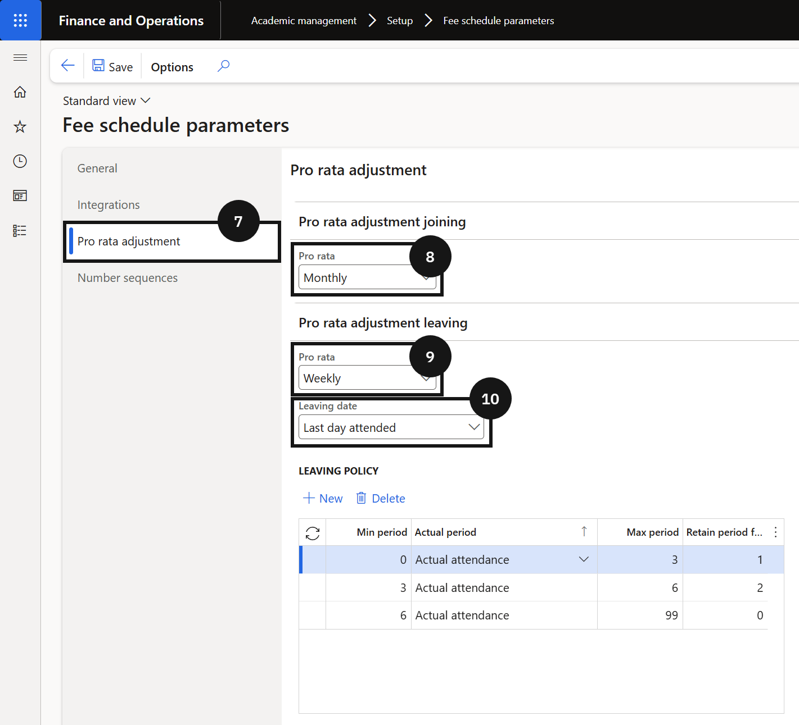

<!-- GEMS: review destination -->

# Configure Fee Schedule Parameters

1. Open Fee schedule parameters

   From the **FNO dashboard**, open **Modules ▸ Academic management**, expand **Setup**, and click **Fee schedule parameters**.

2. Complete the General tab

   On the **General** tab, expand each section and complete the fields based on your school's requirements.

3. Configure the Integrations tab

   Click the **Integrations** tab. Select the **Relationship type** — Sibling is used for brother/sister relationships and for calculating sibling order. Select the **ID** that matches the configured relationship type.

4. Set Pro rata and Number sequences

   Click the **Pro rata adjustment** tab and select the **Pro rata adjustment joining** and **Pro rata adjustment leaving** options. For **Leaving date**, choose:
   - **Last day attended** — when the school manages the leaving date as the last day attended.
   - **Expiration date** — when the leaving date is the expiration date in the Academic enrolment table.

   Click the **Number sequences** tab and confirm all number sequences are set for all references.

5. Save

   Click **Save**.

