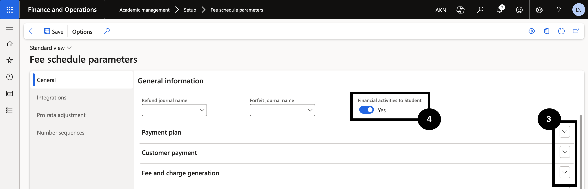
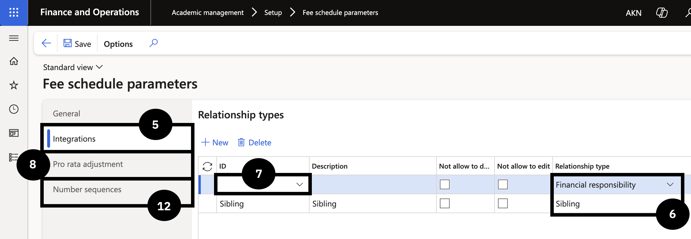

# Configure Fee Schedule Parameters

Fee schedule parameters are where the billing module's core settings live — journals for deposits and payments, user group access, integration of relationship types, and pro rata joining and leaving logic. Complete this once during implementation and revisit only when new functionality is enabled, or organisational settings change. All journals referenced here must already exist in the system.

1. Open Fee schedule parameters

   From the **FNO dashboard**, open **Modules ▸ Academic management**, expand **Setup**, and click **Fee schedule parameters**.

2. Complete the General tab

   On the **General** tab, expand each section and complete the fields based on your school's requirements (③):

   - Deposit handling journals for refund and forfeit.
   - Payment journals for online, over-the-counter, and miscellaneous receipts.
   - User group permissions for generated sales orders.
   - Staff concession cancellation and adjustment setup (applies when a staff contract ends).

   In **Financial activities to Student** (④), select:
   - **No** — when posting financial transactions to the fee payer account.
   - **Yes** — when posting financial transactions directly to the student account.

   

3. Configure the Integrations tab

   Click the **Integrations** tab (⑤). Select the **Relationship type** (⑥)— choose **Financial responsibility** for parents or guardians who pay fee invoices, and **Sibling** for brother/sister relationships used in sibling order calculations. Select the **ID value** that matches the configured relationship type (⑦).

   
   

4. Set Pro rata and Number sequences

   Click the **Pro rata adjustment** tab (⑧) and select the **Pro rata adjustment joining** and **Pro rata adjustment leaving** options. For **Leaving date**, choose:
   - **Last day attended** — when the school tracks the leaving date as the last day attended.
   - **Expiration date** — when the leaving date is the expiration date in the Academic enrolment table.

   Click the **Number sequences** tab (⑫) and confirm all number sequences are set for all references.

5. Save

   Click **Save**.
