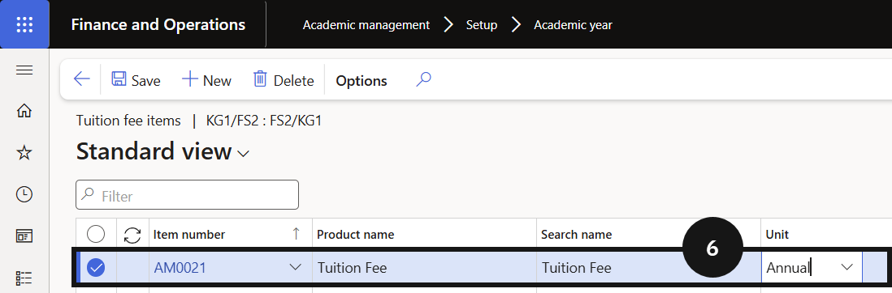

# Link Tuition Fee Item to Academic Year

This step is required for enrolment deposit calculations. The system uses this link to identify the tuition fee item and look up the correct annual price from the trade agreement.

1. Open the academic year and add the tuition fee item

   From the **FNO dashboard**, open **Modules ▸ Academic management**, expand **Setup**, and click **Academic year** (③). Select the relevant academic year record and click **Tuition fee items** (④). Click **New** in the tuition fee items section and complete the columns to link the tuition fee item.

   

2. Add a second tuition fee item (optional)

   If a second tuition fee item exists for another student type, click **New** and add that item. Repeat for each additional academic year (⑥).

   

3. Save

   Click **Save**.
