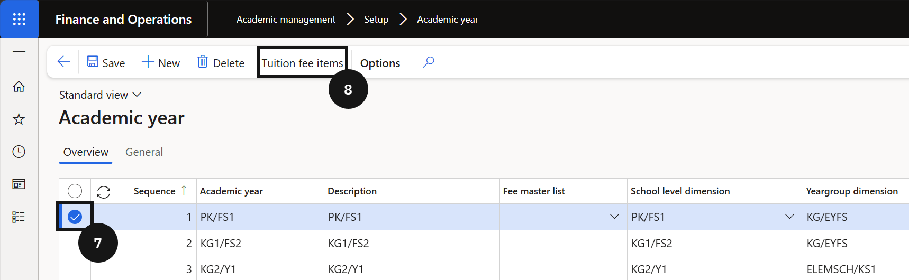

# Set Up Academic Year

Academic year IDs must match the setup in the student management system. The sequence number controls the order used for future billing calculations.

1. Create the academic year record

   From the **FNO dashboard**, open **Modules ▸ Academic management**, expand **Setup**, and click **Academic year**. Click **New** in the toolbar. Enter the next **sequence number** in order and complete the remaining fields in the row. Click **Save**.

2. Add tuition fee items

   Highlight the **academic year** record and click **Tuition fees** in the toolbar. Add the **re-enrolment deposit fee** and **enrolment deposit fee** items. If the school has students eligible for an alternative fee structure (e.g., foundation students), add the **additional tuition fee** item.

3. Save

   Click **Save**.

