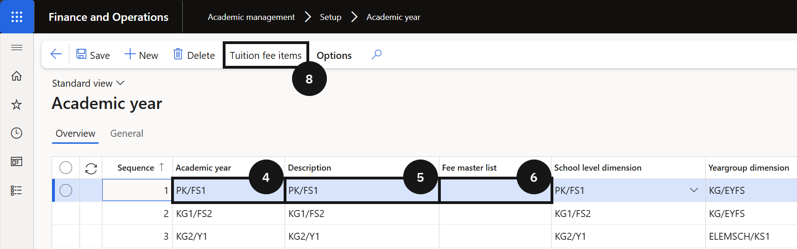
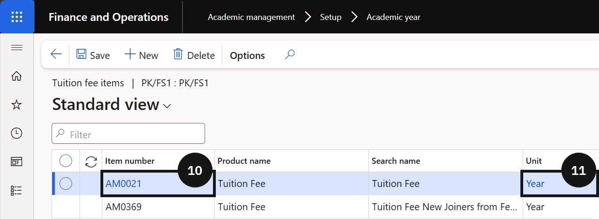

# Set Up Academic Year

Academic year setup defines the academic calendar structure used across the platform and must align with the configuration in the student management system. Tuition fees for re-enrolment and enrolment deposits are attached to the academic year record so the system can look up the correct fees during the deposit process.

1. Create the academic year record

   From the **FNO dashboard**, open **Modules ▸ Academic management**, expand **Setup**, and click **Academic year**. Click **New** in the toolbar and complete the following:

   - **Academic year** — enter the short code (e.g., *KG1*, *01*, *02*). This code is used internally and must match the grade code in the student management system.
   - **Description** — enter the full grade name (e.g., *KG1*, *Grade 1*). This is displayed to users across Academic Management.
   - **Fee master list** — select the applicable code. The Fee master list identifies the fees to be sent to the student management system.

   The **Sequence** number is assigned automatically and determines the order grades appear — it cannot be edited.

2. Add tuition fee items

   Click **Save**, then select **Tuition fee items** from the Action Pane. Click **New** and complete the following:

   - **Item number** — select *Tuition fee*. This defines the fee item used to calculate enrolment and re-enrolment deposits.
   - **Unit** — enter *Year* to indicate the tuition fee is charged annually.

3. Save

   Click **Save**.

