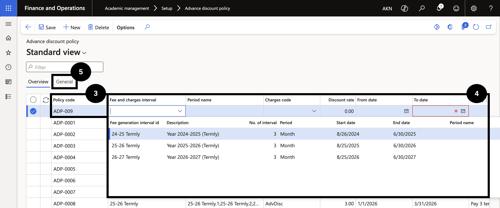
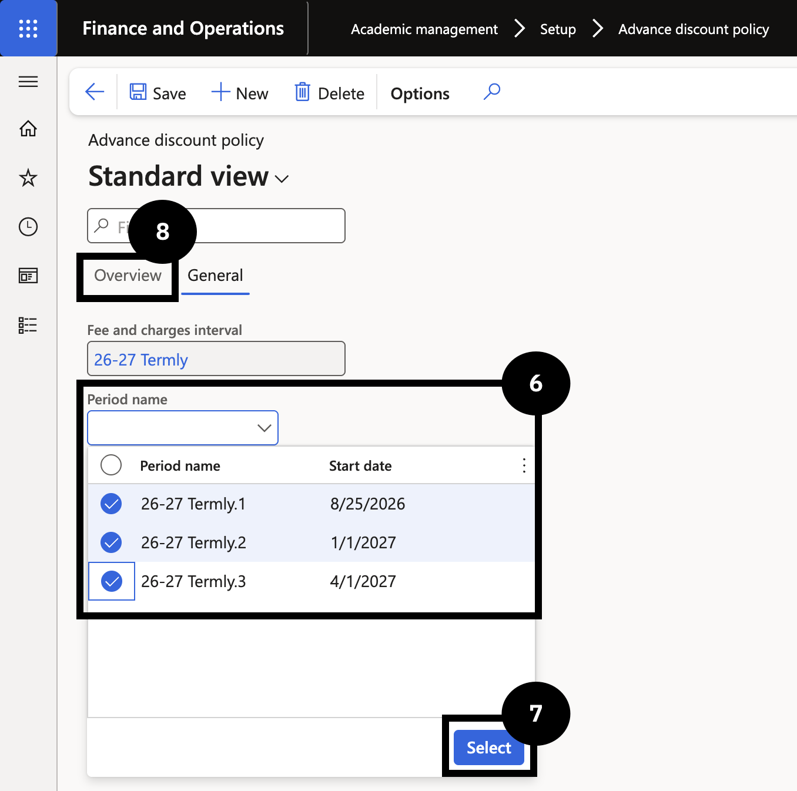
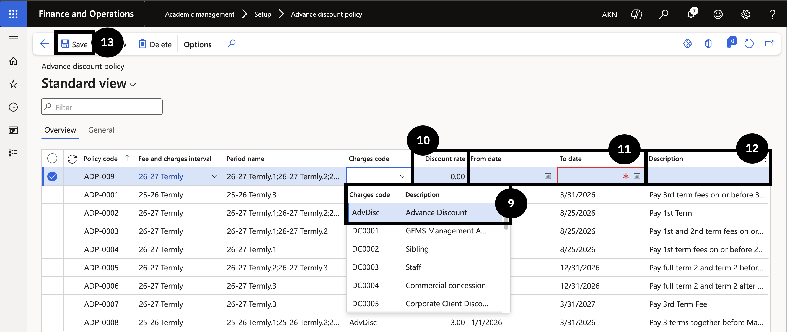

# Set Up Advance Discount Policy

Advance discount policies reward families who pay fees ahead of schedule by applying a discount when payment is received within a specified date window. Each policy is tied to a billing cycle and defines the time period, charge code, and discount percentage that applies.

1. Create the policy and set the interval

   From the **FNO dashboard**, open **Modules ▸ Academic management**, expand **Setup**, and click **Advance discount policy**. Click **New** and complete the following on the **Overview** tab:

   - **Policy code** — enter a value.
   - **Fee and charges interval** — select the billing cycle that applies to this policy.

2. Configure the General tab

   Click the **General** tab. In the **Period name** field, select the relevant time period (more than one may be selected). Click **Select**. Return to the **Overview** tab.

3. Complete the discount details and save

   On the **Overview** tab, complete the remaining fields:

   - **Charges code** — select **Advance Discount**.
   - **Discount** — enter the discount value.
   - **From date** and **To date** — enter the period during which the discount applies.
   - **Description** — enter a description for reporting reference.

   Click **Save**.

