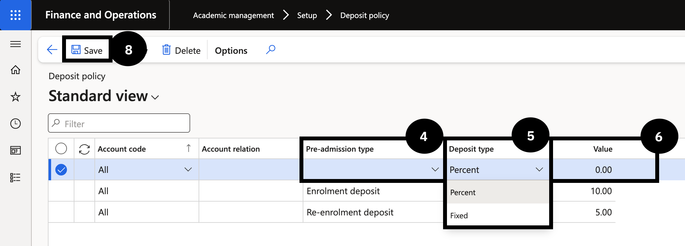

# Set Up Deposit Policy

The deposit policy defines the amount charged to fee payers at enrolment or re-enrolment, before the full fee schedule is generated. Deposits can be configured as either a fixed amount or a percentage of the annual tuition fee linked to the relevant academic year.

1. Create deposit policy records

   From the **FNO dashboard**, open **Modules ▸ Academic management**, expand **Setup**, and click **Deposit policy**. Click **New** in the toolbar and complete the following:

   - **Pre-admission type** — select the appropriate deposit from the dropdown.
   - **Deposit type** — select *Percent* or *Fixed*.
   - **Value** — enter the deposit amount or percentage for the selected type.

   Repeat for each deposit type that needs to be set up.

2. Save

   Click **Save**.

