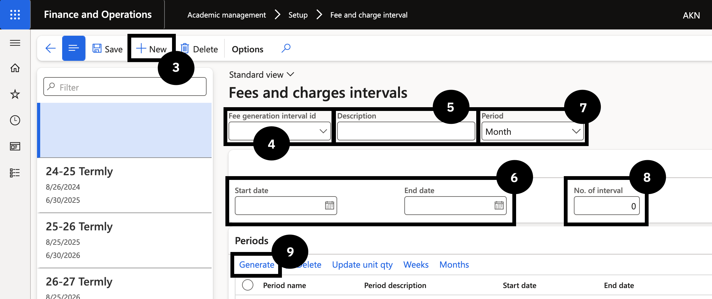
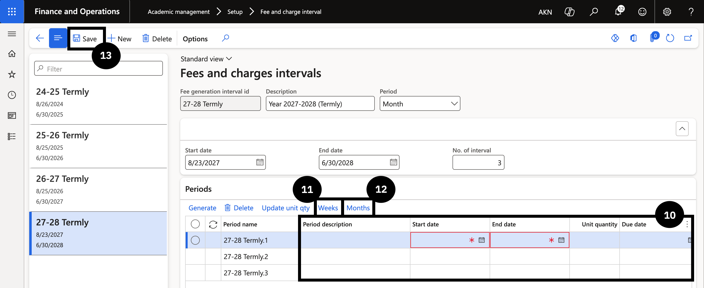

# Set Up Fee and Charge Interval

The fee and charge interval defines the academic billing cycle and the individual periods within it. It is the link between students, fee schedule templates, and the fee generation batch — any student whose academic enrolment record does not contain a matching interval will be excluded from billing runs.

1. Create the interval

   From the **FNO dashboard**, open **Modules ▸ Academic management**, expand **Setup**, and click **Fee and Charge Interval**. Click **New** in the toolbar and complete the following:

   - **Fee generation interval ID** — enter a code (e.g., *2025-2026*).
   - **Description** — enter a description.
   - **Start date** and **End date** — enter the start and end of the school's academic year.
   - **Period option** — select Month or Week based on the school's pricing method.
   - **Number of intervals** — enter the number of invoices to be generated in the year (e.g., *3* for termly, *10* for monthly).

   Click **Generate** in the toolbar to create the periods.

2. Complete each period

   For each period generated:

   - **Period description** — enter a description.
   - **Start date** and **End date** — enter the period dates.
   - **Due date** — enter when payment is expected.
   - **Revenue recognition date** — enter if deferral is required.

   Click **Update unit quantity** so the system calculates the number of months or weeks within the period.

3. Generate weeks and months

   Click **Weeks** in the Periods toolbar and then **Generate** to populate the week dates for each period. This is required only for pro-rata joining and leaving policies. Then click **Months** and **Generate** to populate the month dates.

4. Save

   Validate all entered data for accuracy, then click **Save**.

