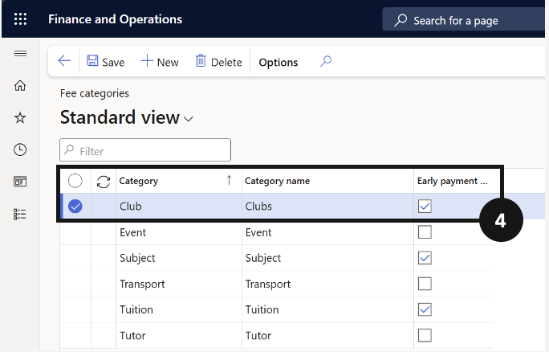

# Set Up Fee Categories

Fee categories classify the type of activity associated with each fee item and are used throughout the system to drive accounting, reporting, and fee schedule logic. Once categories are created in Academic Management, they must be linked to the corresponding released product in Product information management.

1. Create fee categories

   From the **FNO dashboard**, open **Modules ▸ Academic management**, expand **Setup**, and click **Fee categories**. Click **New** in the top toolbar and complete the columns to create new fee categories. Click **Save**.

2. Link categories to released products

   Navigate to **Modules ▸ Product information management**, expand **Products**, and click **Released products**. Filter by **Item number** to locate the items that correspond to the fee categories just created (categories related to Academic Management start with the letters AM). Select the item, expand the **Sell** tab, and locate **Activity ▸ Fee category**. Ensure the fee category aligns with the category it will be billed as.

