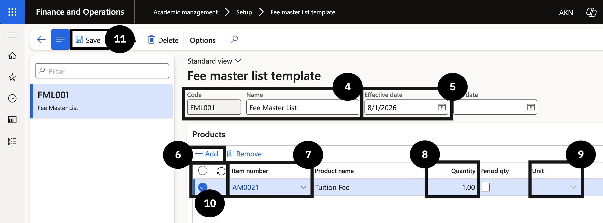

# Set Up Fee Master Template to Sync Items to CE

This setup creates a fee master list template that determines the fee items synced from D365 F&O to CE for inclusion in student offer letters.

1. Create the fee master template

   From the **FNO dashboard**, open **Modules ▸ Academic management**, expand **Setup**, and click **Fee master list template**. Click **New** in the toolbar and complete the following:

   - **Code** and **Name** (④) — enter values for the template.
   - **Effective date** (⑤) — enter the date.

   In the Products section, click **+ Add** (⑥) and complete the following:

   - **Item number** (⑦) — select the fee item to sync to D365 CE.
   - **Quantity** (⑧) — set to *1*.
   - **Unit** (⑨) — select the annual option.

   In the **Switch view** field, select **All**, then select your template row. Click **Save** (⑪).

   

2. Link the template to academic years

   Navigate to **Modules ▸ Academic management**, expand **Setup**, and click **Academic year**. Select each academic year row and choose the **Fee master list** (⑭) code from the dropdown. Repeat for each academic year.

   

3. Save

   Click **Save**.

