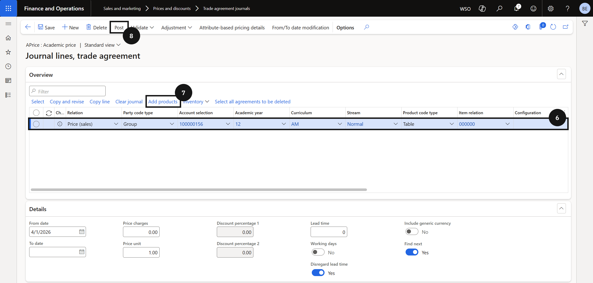

# Set Up Non-Tuition Item Prices

Non-tuition items such as ID cards use a standard trade agreement. Academic attributes are not required and should not be selected for these items.

1. Create the trade agreement journal and add lines

   From the **FNO dashboard**, open **Modules ▸ Sales and marketing**, expand **Prices and discounts**, and click **Trade agreement journals**. Click **New** and in the **Name** field select the standard journal name (without academic attributes enabled). Click **Lines**.

   Click **New** and complete the required fields for the item. Click **Add products** and repeat for each additional item.

2. Post

   Click **Post** to activate the prices.

