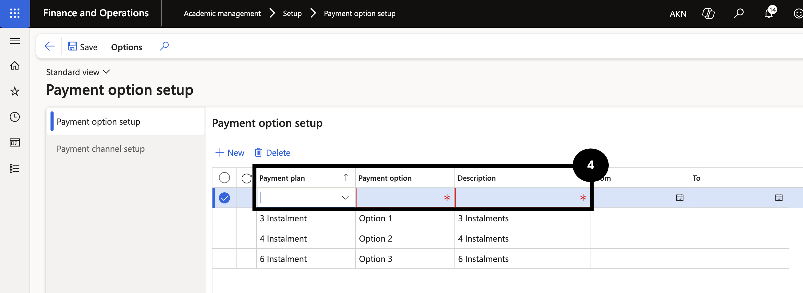

# Set Up Payment Options

1. Open Payment option setup and create a new entry

   From the **FNO dashboard**, open **Modules ▸ Academic management**, expand **Setup**, and click **Payment option setup**. Click **New** and complete the following:

   - **Payment plan** — select from the dropdown.
   - **Payment option** — enter the option code.
   - **Description** — enter a description. (④)

   Once saved, the payment option appears on the Customer master or Student master.

   

2. Save

   Click **Save**.
