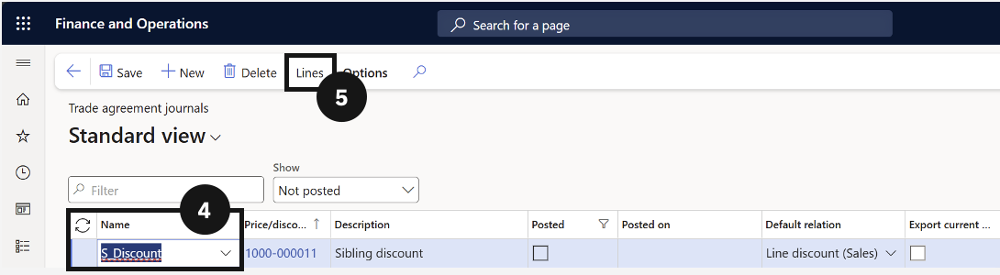

# Set Up Trade Agreement (Sibling Discount)

Trade agreements define the discount percentages applied to students based on their sibling order position. A sibling discount journal is created in Sales and Marketing with a separate line for each child position and the corresponding discount rate.

1. Create the trade agreement journal

   From the **FNO dashboard**, open **Modules ▸ Sales and marketing**, expand **Prices and discounts**, and click **Trade agreement journals**. Click **New** and in the **Name** column select **Sibling discount** (④). Change view to **Lines** (⑤).

   

2. Add discount lines

   Click **New** and complete the following columns:

   - **Party code type** — change to **Group**.
   - **Account selection** — select the sibling position (e.g., *First child*).
   - **Product code type** — change to **Group**.
   - **Item relation** — set to **Sibling discount** (⑥).

   In Details, set the policy **start and end date** (leave end date blank to run indefinitely) (⑦). Enter the discount amount in **Discount percentage 1** (e.g., *10.00* for 10%) (⑧).

   Click **New** to add the next sibling position and repeat until all positions are configured (⑨).

   

3. Save and Post

   Click **Save**, then click **Post** (⑮) to activate the trade agreement policy.

4. Link items to the sibling discount group

   Navigate to **Modules ▸ Product information management**, expand **Products**, and click **Released products**. Open each tuition-related item (⑭). Expand the **Sell** section, scroll to **Line discount group** (⑯), and select the Sibling discount trade agreement. Click **Save**. Repeat for all tuition fee items.

   

   
