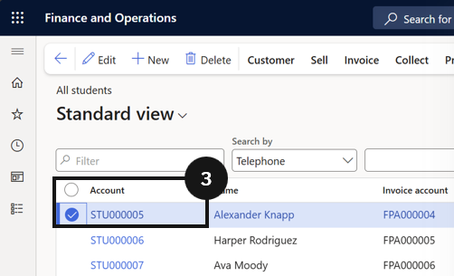

# Debtor Management

Debtor Management covers the student and fee payer record management that underpins accurate fee generation. It includes verifying that each student has the correct academic year, enrolment dates, and sibling order assigned before any fee batch is run, and confirming that financial responsibility percentages across all fee payers on a student's account total 100. It also covers the setup of split financial responsibility, allowing schools to define default billing percentages across multiple fee payers such as parents or guardians. Any errors in this data at the debtor level flow directly through to generated invoices, making this a critical step before running any billing cycle.

---

## Student Master
The student master is based on details created on the enrolment record in the student management system. Academic attributes and demographic information should not be edited directly in D365 F&O; changes should be made at the source, and the record will automatically synchronise to D365 F&O, ensuring data integrity. Accurate fee generation depends entirely on the quality of the data held against each student's record. Before running any fee batch, it is essential to verify that each student has the correct academic year assigned, that their enrolment effective and expiration dates are current, that sibling order numbers are set for students eligible for family discounts, and that the financial responsibility percentages across all fee payers add up to 100. Any gaps or errors in this data at this stage will flow through to the invoices generated, making it significantly harder to correct after the fact.

## Check Student Master

1. From the **FNO dashboard**, open **Modules** ▸ **Academic Management**.
2. Expand **Students** and click **All students**.
3. Click on a **student**'s name to retrieve their details.
4. Confirm the Current academic year under Enrolment details and update if required in the student management system.
5. Open the **Academic** tab in the top toolbar.
6. Click on **Academic enrolments** under Related information.
7. Confirm the **Effective date** and **Expiration date** and update if needed.
8. Click **Back** in the top toolbar.
9. If the student has siblings, confirm the Sibling field under General has a number (e.g., eldest sibling = 1).
10. In the Relationships section, ensure the total **Paid percentage equals 100.00**.
11. Click **Save** if any changes were made.

---

## Fee Payer as Customer

---

## Student Setup - Financial Responsibility

>**Note:** *If using Fee Payer as a customer and not a student, the financial responsibility is managed in the Student Management system and synchronised to D365 F&O. Below is the process to view this setup in D365 F&O.*

1. From the **FNO dashboard**, open **Modules** ▸ **Academic Management**.
2. Expand **Students** and click **All students**.
3. Select the **student profile**.
4. Under the student's account in the **Relationships** section, ensure **at least two fee payers** are assigned (e.g., Mom and Dad).
5. Assign default **split percentages** for each payer (e.g., 50% each).

> **Note:** *This is the baseline for all fees unless overridden.*

---

