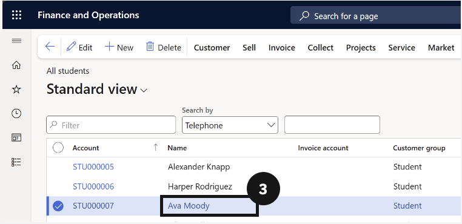
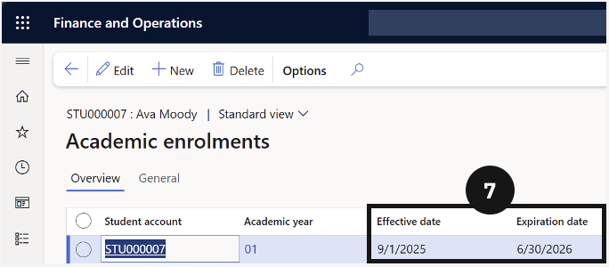

# Check Student Master

The student master is built from enrolment data created in the student management system. Academic attributes and demographic information must not be edited directly in D365 F&O — changes made at source synchronise automatically. Verify the following before running any fee batch.

1. Open the student record

   From the **FNO dashboard**, open **Modules ▸ Academic Management**, expand **Students**, and click **All students**. Click the student's name to open their record.

2. Confirm academic year and enrolment dates

   Under **Enrolment details**, confirm the **Current academic year** is correct. If it needs updating, the change must be made in the student management system.

   Click the **Academic** tab in the toolbar, then click **Academic enrolments** under Related information. Confirm the **Effective date** and **Expiration date** are current. Click **Back** when done.

3. Confirm sibling order and paid percentage

   If the student has siblings eligible for a family discount, confirm the **Sibling** field under General contains a number (e.g., eldest sibling = 1).

   In the **Relationships** section, confirm the total **Paid percentage equals 100.00** across all assigned fee payers.

4. Save

   Click **Save** if any adjustments were made.

